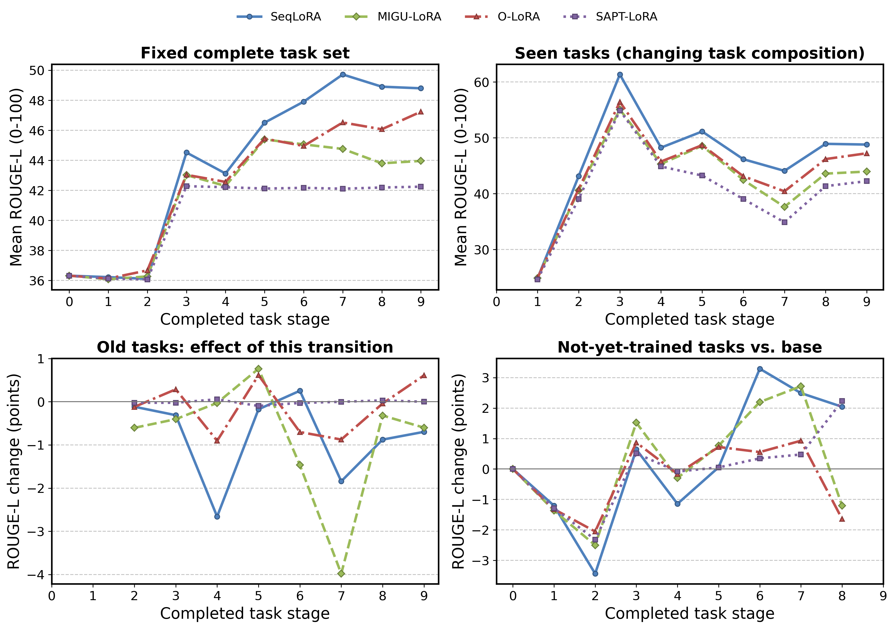

# LLMCL：持续学习实验报告

这组实验研究模型接着学习新任务时，是否能学会新内容，同时保留旧能力。四种方法为 SeqLoRA、MIGU-LoRA、O-LoRA 和 SAPT-LoRA；语言、医学语言及含图像实验均已完成。

## 先看模型实际做什么

以下是 Qwen2-VL 九任务测试样本的节选，回答来自 SeqLoRA 的最终模型；每任务取固定顺序第一条，示例未按得分挑选。

| 任务 | 输入节选 | 参考答案节选 | SeqLoRA 最终回答节选 |
|---|---|---|---|
| 新闻摘要（XSum） | Cross, who has admitted to the murders, said he hoped to "die a martyr" after the verdict … | White supremacist Frazier Glenn Cross has been found guilty of murdering three people at t… | A white supremacist who shot dead three people at a Jewish community center in Kansas City… |
| 阅读理解（Quoref） | Passage: It was probably William the Conqueror who gave the city and its castle to Bishop … | Rochester. | William the Conqueror |
| 关系抽取 | radio can be used as the opposite of tv | radio Antonym tv | radio Antonym tv |
| 对话续写（PersonaChat） | Personality: I try to limit how much I eat. I whine a lot. I've a golden retriever puppy. … | I like being at home with the puppy. I eat a lot and should really limit that. | I do not have a job. |
| 因果推理（GLUCOSE） | story: All the towels in the house are wet. There are only four of us living here. There a… | The towels are wet &gt;Causes/Enables&gt; The towels dry out | All the towels are wet &gt;Causes/Enables&gt; Someone is extra dry |
| 医患对话转临床记录（MTS-Dialog） | Doctor: I spoke with Poison Control regarding the possible ingestion of the liquid. They l… | I discussed the case with Poison Control and apparently this is actually relatively small … | No further action. |
| 影像 Findings 转 Impression（IU-Xray） | The cardiomediastinal silhouette is normal in size and contour. Hyperexpanded lungs withou… | Negative for acute abnormality. | No acute cardiopulmonary abnormality. |
| 自然图像问答（VQAv2） | Answer the question briefly using the image. Is it cold outside? | no | yes |
| 医学图像问答（VQA-RAD） | Answer the question briefly using the image. Are the lungs normal appearing? | No | No |

完整输入、参考、图片，以及四方法在学习前、刚学完和最终的回答见 [含图像实验实例](summary_cv/examples.md)。T5 七任务的数据示例见 [语言实验报告](summary/README.md#先看七个任务的真实示例)。

## 大体效果

### Qwen2-VL-2B：语言 → 医学语言 → 自然图像 → 医学图像

| 方法 | 最终均分 AP ↑ | 遗忘幅度 ↓ | BWT ↑ | FWT ↑ |
|---|---:|---:|---:|---:|
| SeqLoRA | 48.799 | 3.890 | -3.864 | -3.397 |
| MIGU-LoRA | 43.964 | 4.871 | -4.586 | -2.559 |
| O-LoRA | 47.239 | 0.736 | -0.498 | -2.050 |
| SAPT-LoRA | 42.247 | 0.084 | -0.030 | -1.206 |

SeqLoRA 最终整体分数最高；SAPT-LoRA 遗忘最少，但整体分数较低。自然图像问答最终 EM 约 83.5%–86.0%，医学图像问答约 45.5%–49.5%。领域、逐任务结果和例子见 [summary_cv](summary_cv/README.md)。

### T5-Large：七个通用语言任务

| 方法 | 最终均分 AP ↑ | 遗忘幅度 ↓ | BWT ↑ | FWT ↑ |
|---|---:|---:|---:|---:|
| SeqLoRA | 25.634 | 5.352 | -4.943 | 2.340 |
| MIGU-LoRA | 23.084 | 1.944 | 1.213 | -2.864 |
| O-LoRA | 21.926 | 0.297 | 4.603 | -3.882 |
| SAPT-LoRA | 12.030 | 0.810 | 0.969 | -0.652 |

本轮 SeqLoRA 的最终均分最高，O-LoRA 的遗忘幅度最小。七任务成绩和阶段矩阵见 [T5 报告](summary/t5_large_comparison.md)；随后学习医学语言的效果见 [医学续训报告](summary/medical_continuation.md)。

两轮模型、任务数量和测试配额不同，以上表格分别解读。均为一个种子、一个任务顺序的先导实验，尚没有多次重复的均值和误差范围。

## 过程中的能力变化

阶段记录已复原为完整任务矩阵、领域与逐任务曲线、旧任务切换冲击和同一道题的回答演变，同时重算 MFT、MFN、MAA、AP、遗忘、BWT 与 GEM FWT，分别保留 ROUGE-L / EM / Token F1 口径。



<!-- figure-caption:start -->
**图 1｜Qwen2-VL 九任务：整体学习与保留过程。**

> **坐标与阶段：** 横轴是已完成学习的任务数。阶段 0 是未训练基座；1–5 依次学习摘要、阅读理解、关系抽取、对话、因果推理；6–7 学习医学对话记录和影像报告；8–9 学习自然与医学图像问答。
>
> **四个子图：** 左上在固定全部任务上算平均 ROUGE-L（0–100），看整体水平；右上只平均已学任务，看已学表现，但任务集合会增加。左下是本阶段更新前后，同一组旧任务的平均分差，负值说明旧任务受损；右下是尚未学习任务相对基座的平均分差，正值说明前序学习可能有帮助。下面两个子图的单位是分数点，0 线表示无变化；没有可比较任务时留空。
>
> **方法与读法：** 蓝色实线圆点＝SeqLoRA；绿色虚线菱形＝MIGU-LoRA；红色点划线三角＝O-LoRA；紫色点线方块＝SAPT-LoRA。先看左上是否整体提高，再看左下在哪一步出现下降。右上和右下的任务构成随阶段变化，曲线起伏也可能来自构成变化，需结合逐任务曲线。ROUGE-L 衡量参考文字重合，不是事实正确率。
<!-- figure-caption:end -->

[学到了多少及保住多少](summary_cv/learning_gain.md) · [各报告阅读说明](summary_cv/README.md#每份报告能说明什么) · [Qwen 全过程与指标表](summary_cv/process.md) · [T5 全过程](summary/learning_process.md) · [回答演变](summary_cv/answer_evolution.md) · [各论文指标对应关系](paper/evaluation_and_process.md)。

还用全部阶段 checkpoint 补测了固定 198 道外部 MMLU 题，形成通用与医学知识保留曲线，共 7,920 条预测。它们是小样本探针，不能代表模型全部知识。准确率及逐题变化见 [外部知识报告](summary_cv/knowledge_probe.md)。独立单任务训练、Oracle、多种子等缺失对照在报告中标为 N/A。

## 指标怎样理解

| 指标 | 含义 | 怎样读 |
|---|---|---|
| ROUGE-L ↑ | 答案与参考文字的最长公共子序列 F1 | 看词面重合；不等同于事实或医学正确率 |
| EM ↑ | 答案规范化后的完全匹配比例 | 0–100，可读作精确匹配百分比 |
| Token F1 ↑ | 答案与参考的词覆盖精确率、召回率的调和平均 | 可反映部分答对，不要求词序一致 |
| AP ↑ | 全部学完后的任务 ROUGE-L 等权平均 | 看最终整体表现 |
| F.Rate ↓ | 旧任务历史最好分到最终分的平均下降 | 看遗忘幅度，单位为分数点，允许负值 |
| BWT ↑ | 旧任务最终分相对刚学完时分数的平均变化 | 正值为改善，负值为下降 |
| FWT ↑ | 尚未训练任务相对初始基座的平均分数变化 | 看前序学习是否帮助未来任务 |

任务分数与 AP 采用 0–100。AP 基于 ROUGE-L；差值指标的单位是分数点，可以为负。多参考答案时每项取最大匹配分，再对固定测试样本平均。VQAv2 的 EM 是归一化多参考精确匹配，不能当作官方 VQA 共识准确率。

完整定义和手算例子见 [指标说明](summary/README.md#指标定义)。摘要、对话和医学记录可能有多个合理表达，文字重合分数需要结合真实回答理解。

## 数据与报告范围

| 实验 | 学习内容 | 每任务 Train / Dev / Test | 报告 |
|---|---|---|---|
| T5-Large 七任务 | 摘要、阅读理解、关系、对话、因果、科学问答 | 1000 / 200 / 500 | [语言报告](summary/README.md) |
| T5-Large 医学续训 | 医患对话转记录、Findings 转 Impression | 新任务 1000 / 100 / 200，旧任务保留 500 测试 | [医学续训](summary/medical_continuation.md) |
| Qwen2-VL 九任务 | 5 通用语言 + 2 医学语言 + 2 图像问答 | 1000 / 100 / 200 | [含图像报告](summary_cv/README.md) |

数据使用固定划分；视觉任务按图像或病例分组避免划分交叉，属于本地先导子集。模型权重统一在 `model/`，论文统一在 `paper/`。

## 实现流程与复现

训练前先测全部任务的基线，之后依次学习，每学完一个任务复测全部任务。Dev 用于选择 checkpoint，Test 用于报告；各方法独立保存状态。完整实现、原论文适配、参数和恢复说明见 [exp/README.md](exp/README.md#实现流程与复现)。

| 路径 | 用途 |
|---|---|
| `summary/` | 语言和医学语言报告、指标与示例 |
| `summary_cv/` | 含图像实验报告、领域/任务/类别分数及示例 |
| `data/`、`CV_data/` | 文本与图像原始数据、固定划分 |
| `model/`、`paper/` | 统一模型权重与论文 |
| `code/` | 四方法实现 |
| `exp/`、`rules/` | 训练/评价入口、协议、参数和锁定数据清单 |
| `exp/result/`、`exp/CV_result/` | 独立运行、逐题回答、日志、checkpoint 与实现快照 |
| `sample/` | GitHub 报告展示的少量真实图片与过程图 |
| `source_code/` | 原论文代码及许可证，供方法核对 |

在仓库根目录刷新汇总：

```bash
.conda-env/bin/python summary/collect.py
.conda-env/bin/python summary/collect_medical.py
.vision-env/bin/python summary_cv/collect.py
.vision-env/bin/python summary_cv/process.py
.vision-env/bin/python summary_cv/reconstruct_metrics.py
.vision-env/bin/python summary_cv/learning_gain.py
.vision-env/bin/python summary_cv/collect_knowledge_probe.py
.plot-env/bin/python summary_cv/plot_process.py
```

创建新的 Qwen2-VL 实验运行：

```bash
.vision-env/bin/python exp/start_cv_detached.py
```

实验启动采用 nohup 和独立进程会话；每次训练更新保存恢复状态，关闭终端可继续运行。旧实验来源、模型与代码指纹保留在运行目录；恢复要求参数、实现与数据一致。详细协议：[T5](rules/002_t5_large_trial.md)、[医学续训](rules/003_medical_continuation.md)、[Qwen2-VL](rules/004_qwen2vl_cv.md)。
