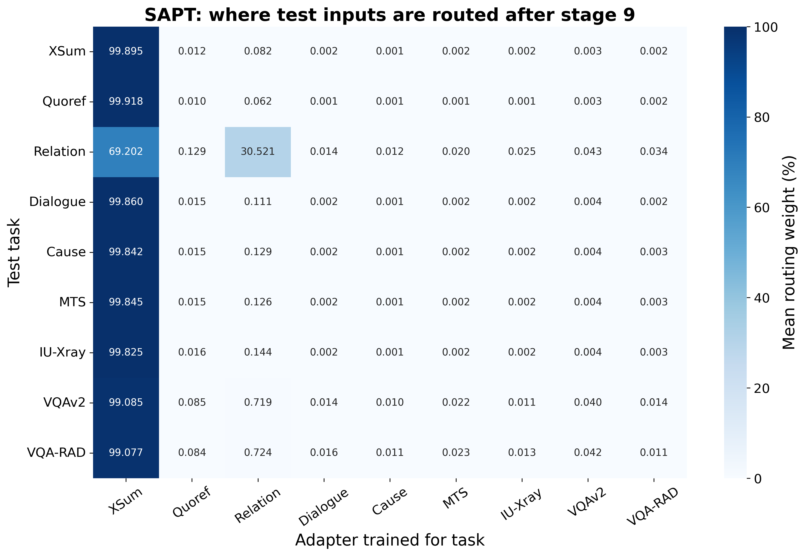
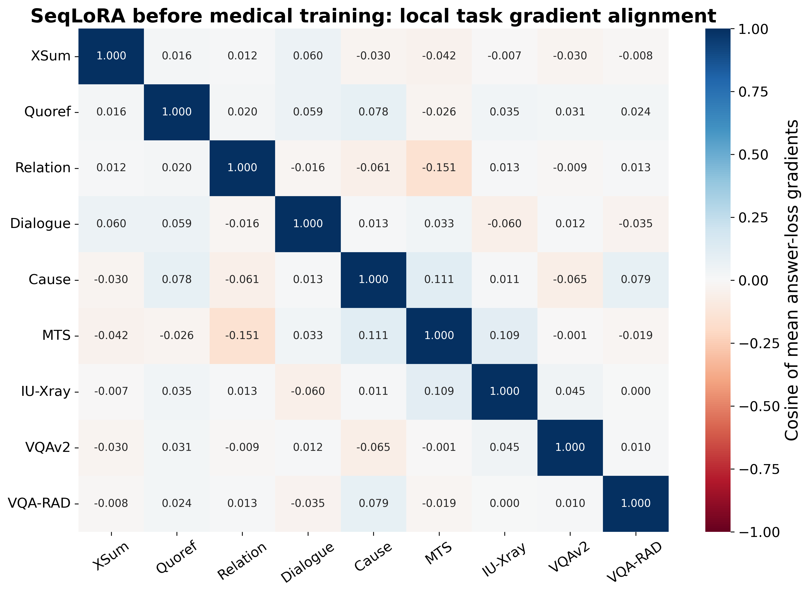

# LoRA模块的共性与方法差异

共性是所有任务依赖同一语言主干中的注意力Q/V适配路径；医学适配既要改变注意力与输出，又不能扰动旧任务。四方法对这两件事的处理不同，不能概括成同一个代码bug。

## 先看最明确的路由问题

**图 1｜SAPT 阶段9的实际路由。** 横轴是九个任务的adapter，纵轴是被评测任务；每格为该任务200个测试输入的平均路由权重（%，一行合计100%），色条范围0–100。颜色越深表示使用该adapter越多。XSum=摘要、Quoref=阅读理解、Relation=关系抽取、Dialogue=对话、Cause=因果、MTS=临床记录、IU-Xray=影像报告文字、VQAv2=自然图像、VQA-RAD=医学图像。本图由checkpoint内部router重新计算，是路由热图，不是成绩矩阵。绝大多数输入集中到第一任务adapter，医学专属adapter几乎关闭。

| 医学任务 | 刚学完时专属adapter平均权重 | 最终专属adapter平均权重 |
|---|---:|---:|
| medical_mts_dialog_note | 0.004958% | 0.002018% |
| medical_iu_xray_impression | 0.005073% | 0.002253% |
| medical_vqa_rad | 0.011144% | 0.011144% |

SAPT共享router使用冻结融合输入的逐维max池化，缺少显式task-ID训练监督；历史KL目标在新任务维度补零。实现允许新专家被低概率选中。历史保护、共享提示和非上下文化池化一起形成“老专家占优—新专家梯度变小—更难获得使用率”的可能反馈链。权重塌缩已实测；是哪一项最先导致塌缩，仍需改变池化/初始化/KL的重训消融。

固定checkpoint，只把门控设为真实任务对应adapter（oracle task-ID），得到以下参考答案teacher-forced CE：

| 阶段 | 任务 | 学到的路由CE | 强制专属adapter CE |
|---|---|---:|---:|
| 6 | medical_mts_dialog_note | 2.095 | 1.958 |
| 7 | medical_mts_dialog_note | 2.095 | 1.958 |
| 7 | medical_iu_xray_impression | 2.856 | 2.112 |
| 9 | medical_mts_dialog_note | 2.094 | 1.958 |
| 9 | medical_iu_xray_impression | 2.855 | 2.112 |
| 9 | medical_vqa_rad | 1.107 | 2.143 |

每任务固定16题，无参数更新。医学文字CE变低，支持选错专家确实限制使用已学文字适配；医学图像CE由1.107升至2.143，说明其专属专家本身也未学好。强制路由不是可部署方法，CE降低也不等于生成准确率一定提高。

## 为什么共享模块会扰动别的任务

$$
\Delta W=\frac{\alpha}{r}BA,\qquad h\mapsto Wh+\Delta Wh,
$$

$$
\operatorname{Attention}(Q,K,V)=\operatorname{softmax}\!\left(\frac{QK^{\mathsf T}}{\sqrt d}\right)V.
$$

Q的更新改变token之间的注意力分配，V的更新改变被聚合的内容；作用于所有走过该层的输入，而不只医学输入。冻结基座只表示原参数不变，输出函数仍随adapter改变。小权重变化也可使原本接近的答案logit换序，导致greedy答案跳变。

医学任务特别依赖〈实体、部位/侧别、属性、时间、否定/不确定性〉关系。“有/无”“左/右”“急性/慢性”可能只差很少token，但语义完全不同。当前普通答案CE、ROUGE选模和Q/V路径没有显式保护这些关系，短答案或常见正常句式更容易获得稳定损失下降。该解释由实例和模板统计支持，但没有实体级标注来证明每种关系的发生率。

**图 2｜SeqLoRA在阶段5、医学训练前的局部梯度关系。** 横纵轴为同样的九任务，每格是各任务固定8个测试样本平均答案CE梯度的余弦。红色负值=在小步梯度下降近似下，改善一个任务可能损害另一个；蓝色正值=局部方向较一致，白色≈0=接近正交。对角线为1，色条固定−1到1。梯度只来自共享adapter；dropout关闭、没有optimizer更新。小样本局部关系不能直接预测完整63次AdamW更新。

MTS与旧关系抽取梯度余弦为−0.151；医学报告与对话为−0.060。也有正方向，例如MTS与因果任务+0.111。实测并不是“所有医学梯度都对抗所有旧任务”。阶段5→6在关系抽取上的有限更新CE增加0.0265；阶段8→9在自然VQA上的CE增加0.0984，支持某些共享更新产生扰动。

一些一阶预测与完整阶段变化相反，例如阶段6→7的MTS：一阶估计−0.0444，实测+0.0399。原因可能包括有限步长、非线性和训练样本不同；不能把一次梯度角度当作整个遗忘过程的充分解释。数据见 [实际更新与梯度投影](update_gradient_projections.csv)。

## O-LoRA：约束保护很强，但权重正交不等于功能独立

| 医学阶段 | 答案CE梯度范数 | 正则梯度范数 | 比值 |
|---|---:|---:|---:|
| 6 | 1.708 | 38.440 | 22.509× |
| 7 | 1.652 | 42.030 | 25.434× |
| 9 | 3.925 | 48.395 | 12.331× |

在各阶段已学checkpoint上，每任务固定8题，当前adapter可训练、历史adapter冻结；单独对加权正则和答案CE求导。正则梯度大12.3–25.4倍，且二者夹角接近90度，说明主要优化压力存在于答案损失之外。原训练日志的总梯度也频繁被clip到1。

该实现把各层、所有历史adapter的A矩阵交叉绝对值求和，权重0.5未按历史任务数/层数/矩阵大小归一化，所以历史越多约束项越大。AdamW会按坐标归一化梯度，不能由范数比直接推出医学梯度只剩1/25；需要重训约束强度消融。

A矩阵正交限制了输入低秩方向，但所有adapter在推理时同时加到同一输出。权重空间Frobenius近正交，不保证在医学/旧任务的各向异性输入上输出影响独立，也没有语义保护“否定、侧别”等字段。原代码见 [O-LoRA](../../code/olora.py)。

## MIGU：按幅度筛梯度，不按医学事实重要性

| 梯度诊断任务 | 被保留的梯度能量 | A/down行保留 | B/up行保留 |
|---|---:|---:|---:|
| task002_quoref_answer_generation | 36.20% | 37.50% | 30.05% |
| medical_mts_dialog_note | 35.39% | 37.50% | 30.05% |
| medical_iu_xray_impression | 35.68% | 37.50% | 30.05% |
| medical_vqa_rad | 39.03% | 37.50% | 30.05% |

阶段5的MIGU模型、每任务固定8题。真实实现保留量化阈值0.7以上的通道；rank8的down实际剩3/8行，up剩约30%。医疗任务剩35%–39%梯度能量，通用Quoref也只有36.2%，所以已测到普遍筛除，而非证明专门压制医学。

幅度统计使用prompt+answer所有有效token；up幅度取基座输出与adapter叠加后的投影值，未使用医学实体或答案梯度重要性。弱幅度的罕见医学概念是否被误筛是合理假设，尚没有医学词/通道归因来证实。不能把“幅度大”等同“临床重要”。原代码见 [MIGU](../../code/migu_lora.py)。

## 四方法真正共享的限制

| 共同设置 | 对医学的影响路径 | 已证实到哪一步 |
|---|---|---|
| 只在语言Q/V插入rank8当前adapter；视觉编码器/merger/MLP冻结 | 可改变语言注意力和输出，不能直接学习医学视觉特征或任意更高维表征 | 插入位置和冻结范围已核对；rank8是否不足尚未做rank消融 |
| 新医学任务只有1000样本、63次更新 | 稀有事实、不同部位和记录结构的监督不充分 | 配额、图像数、输出统计已测；需要学习曲线证明预算是主因 |
| 普通CE+ROUGE选模，没有临床关系目标 | 常见句式/短答可以进步，患者特定事实未必同步进步 | 恒定模板与长记录遗漏已测；事实级正确性未完整评测 |
| 没有所有方法统一的原始医学证据回放 | 后续任务改变输出行为时，早先长记录没有直接监督锚点 | Seq/MIGU/O无样本回放；SAPT的反思主要约束路由，不等于医学事实回放 |

Seq/MIGU整体adapter始终rank8；O-LoRA和SAPT累计多个rank8 adapter，不能把它们的累计表达能力也说成rank8。SAPT权重范数报告未乘输入依赖门控，不能把裸adapter矩阵范数当真实有效更新。

## 数据与可复现计算

[各层矩阵诊断](adapter_layer_diagnostics.csv) 使用真正的BA矩阵差、薄QR/SVD和Frobenius内积，避免A/B尺度可互换造成假结论。裸权重更新或奇异值集中都不等于临床知识量。这里未计算相对基座W的奇异向量，因此不声称发现论文中的intruder dimensions。
[训练日志汇总](training_diagnostics.csv) · [router逐题权重](routing_items.json) · [CE/正则梯度](regularization_gradients.csv) · [MIGU掩码](migu_gradient_masks.csv) · [诊断选题与参数](intervention_protocol.json)。所有实验是读取checkpoint后的有限诊断，无训练更新。
