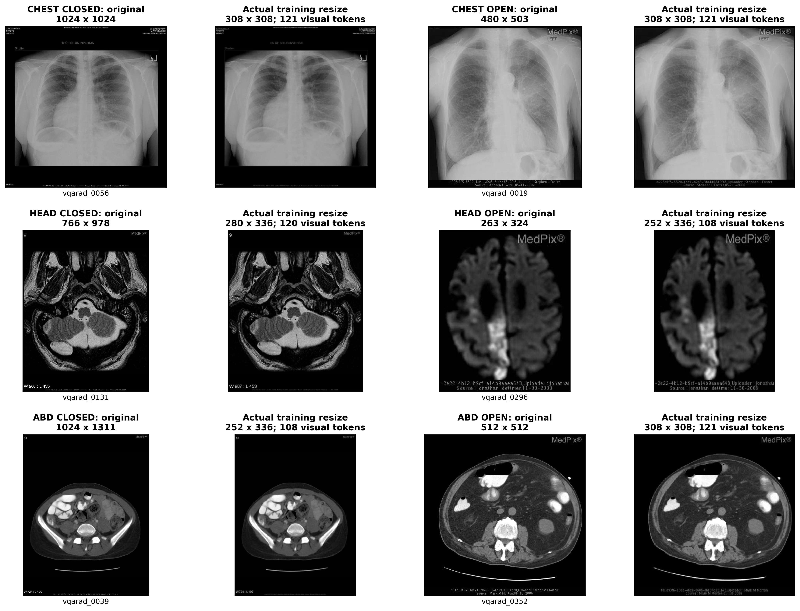
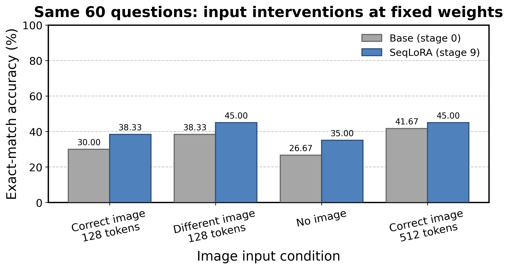

# 医学原图、输入细节与看图依赖

本报告区分“输入细节少”与“模型没有稳健使用该病例图像”。保留原图，检查官方处理器的真实缩放尺寸，并在固定权重下改变图像输入。

## 原图与训练实际看到的空间尺寸

**图 1｜三个部位、两类问题的输入尺寸对照。** 每行依次为胸部、头部、腹部；前两列是CLOSED问题的原图与训练缩放重建，后两列是OPEN问题的对应图。标题给出像素宽×高与合并视觉token数；问题ID可在 [实例报告](01_data_and_cases.md) 查到。缩放尺寸从锁定image_grid计算，用官方同类双三次重采样重建；它是空间输入对照，不是视觉神经特征、病灶标注或注意力图。原图副本未改动。

例如1024×1024的胸片缩到308×308，1024×1311的腹部图缩到252×336；黑边和图中文字也进入输入。细小结构、计数、侧别与成像属性不像自然图像的大物体那样容易从整体形状判断。但是并非所有图都损失同样多：263×324的头部图本身分辨率不高，128-token设置几乎没进一步缩小，增加token不等于恢复原图不存在的信息。

训练视觉编码器与merger始终冻结；所有更新都在语言侧Q/V。已有的通用视觉表征若不能很好编码医学结构，语言LoRA只能重新利用已有特征，不能直接让视觉编码器学会新的解剖/病变表示。这个范围已经代码核对；具体缺了哪一种视觉表征仍需解冻/双侧LoRA对照。

## 固定题目与权重，改变图像输入

**图 2｜60道配对医学问题的图像干预。** 横轴依次是正确图128-token上限、同部位另一图128-token上限、不提供图、正确图512-token上限；纵轴为归一化EM准确率（%，0–100）。灰色是基座阶段0，蓝色是SeqLoRA最终阶段9。每部位×OPEN/CLOSED固定10题，共60题、30张源图片；不同条件严格使用同一题目/参考和同一checkpoint，未训练。数字是这组分层小样本成绩，不能与全200题成绩直接比较。128/512是设置上限，实际token由图像宽高确定。

| 权重 | 条件 | 全60题EM | CLOSED 30题 | OPEN 30题 |
|---|---|---:|---:|---:|
| 基座 | actual128 | 30.000 | 53.333 | 6.667 |
| 基座 | wrong128 | 38.333 | 63.333 | 13.333 |
| 基座 | no_image | 26.667 | 53.333 | 0.000 |
| 基座 | actual512 | 41.667 | 70.000 | 13.333 |
| SeqLoRA最终 | actual128 | 38.333 | 56.667 | 20.000 |
| SeqLoRA最终 | wrong128 | 45.000 | 73.333 | 16.667 |
| SeqLoRA最终 | no_image | 35.000 | 60.000 | 10.000 |
| SeqLoRA最终 | actual512 | 45.000 | 73.333 | 16.667 |

最终模型提高视觉上限后，60题EM由38.33%变45.00%，但OPEN由20.00%降至16.67%；提升主要发生在CLOSED。去图仍达35.00%，正确图的净优势只有3.33点；同部位换图45.00%，没有出现预期整体下降。单个回答仍会随图像改变，因此这不证明模型完全忽略图片。它更支持：当前正确率受答案先验和病例视觉证据混合影响，正确图像的可靠优势尚未建立。换图同部位可能保留粗粒度解剖线索，小样本与答案偏置也可让换图偶然改善。

原实验使用单图缓存特征；补测使用stock视觉编码器按batch计算。正确图128条件在基座与最终均有59/60回答与原实验逐字相同，1题因计算路径/batch差异改变；比较采用补测自身的正确图条件，避免把原分数硬当干预对照。

## 小样本不确定性

| 阶段 | 条件相对正确图128 | EM差（点） | 按图片成组bootstrap 95%区间 |
|---|---|---:|---|
| 0 | wrong128 - actual128 | 8.333 | [0.000, 15.071] |
| 0 | no_image - actual128 | -3.333 | [-16.667, 9.261] |
| 0 | actual512 - actual128 | 11.667 | [2.000, 20.636] |
| 9 | wrong128 - actual128 | 6.667 | [-1.818, 15.789] |
| 9 | no_image - actual128 | -3.333 | [-18.870, 14.036] |
| 9 | actual512 - actual128 | 6.667 | [-5.357, 20.000] |

固定seed42、2000次重采样，保留同一图片的题目相关性。最终模型512−128区间跨0，不能宣称可靠显著收益；这也不是多训练种子的不确定性。试验只是当前60题的探索诊断，更换题库或图片可能得到不同结果。

## 数据、处理器和日志

[480条完整生成记录](vision_ablation_protocol.json) 的清单和图片替换映射固定；逐条文件为 `vision_stage{0,9}_{actual128,wrong128,no_image,actual512}.jsonl`，含问题、原/使用图片、预测、参考、生成token和评分。
[全训练/测试图像尺寸](image_resolution.csv) · [全部分组成绩](vision_ablation_scores.csv) · [配对区间](vision_paired_uncertainty.csv)。高分辨率只改推理输入，没有重训；它不能直接回答更高分辨率训练是否改善。
保留首次高分辨率batch4显存不足日志，随后batch1完成；其他条件batch4。原实验checkpoint及共享图像缓存均未改写。
