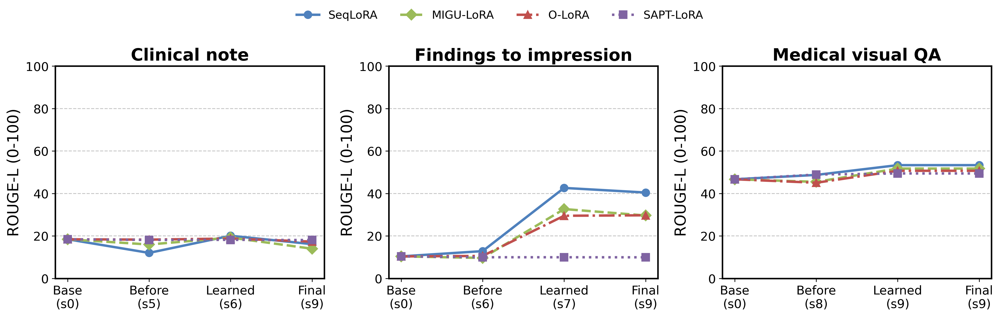

# 医学任务为什么学不好，又为什么扰动其他能力？

分析对象是已完成的 Qwen2-VL-2B 九任务运行。这里新增的是诊断，不改写原实验、参数或评分；重用 72,000 条回答，并补做冻结 checkpoint 的输入与路由干预、梯度检查。

## 先看两个具体失败

- 临床记录参考包含导尿、尿液白细胞、导尿后少量血、腹部 X 线与患儿活动情况；SeqLoRA 学完该任务却只回答 **“Normal.”**。这属于细节遗漏，不能简单解释成换一种说法。
- 影像 Impression 参考写“心脏增大、左肺底瘢痕/肺不张”；模型回答 **“No acute cardiopulmonary abnormality.”**，省略了慢性发现。此处“无急性异常”与慢性心脏增大未必矛盾，问题是信息覆盖不足。

[11 个诊断实例与医学原图](01_data_and_cases.md) 同时保留真正的参考不一致和 “1 / One”“Right / Right hemisphere” 这类词面假失败。实例特意按失败/遗漏选择，用于解释机制，不能代表发生率。

## 先修正对成绩的理解



**图 1｜三种医学任务的学习与保留。** 横轴依次为基座、该任务学前、刚学完、最终；括号内标实际阶段。纵轴是 ROUGE-L（0–100）；蓝色圆点实线为 SeqLoRA，绿色菱形虚线为 MIGU-LoRA，红色三角点划线为 O-LoRA，紫色方块点线为 SAPT-LoRA。三个子图分别是临床记录、文字 Findings→Impression、医学看图问答。医学 VQA 的“刚学完”和“最终”同为阶段 9。只在同一子图比较收益，不能把 ROUGE-L 当医学正确率。

这轮的共性更接近：**共享且受限的适配通道更容易学到短回答、正常模板和答案先验，医学任务所需的病人细节、关系、否定与视觉证据没有同等地被保留。限制更新能减少旧能力变化，也可能让新医学能力几乎不进入模型。** 这是针对本次实现和预算的解释，不是“LoRA 天生不能做医学”的结论。

| 发现 | 直接证据 | 判断强度 |
|---|---|---|
| 医学报告的 ROUGE 提升大部分可由正常模板解释 | 固定训练集最常见回答的 ROUGE-L=39.567；SeqLoRA 最终=40.438，58% 输出该句 | 已测到模板捷径；没有临床事实评分，不能说全部提升都是捷径 |
| 临床记录过度压缩 | 参考平均38.38词；SeqLoRA刚学完15.76词、最终8.76词 | 已测到长度与遗漏；不能仅凭长度判断临床正确性 |
| SAPT新任务门控几乎关闭 | 医学任务专属 adapter 平均权重约0.002%–0.011%；强制路由可降低医学文字参考的CE | 有固定权重干预；图像强制路由反而更差，说明不只是推理时选错专家 |
| O-LoRA保护约束很强 | 医学阶段正则梯度范数为答案CE梯度的12.3–25.4倍 | 已测到梯度竞争；没有重训消融，尚不能归因全部性能差距 |
| MIGU掩码删除多数答案梯度能量 | 医学小样本保留35.4%–39.0%的梯度能量 | 已测到筛除；与通用问答接近，并非已证明医学特异性伤害 |
| 视觉细节预算与证据利用不足 | 128→512 token补测改善；同部位换图未降低平均分 | 小样本支持瓶颈；最终模型分辨率收益的区间跨0，不能声称稳定显著提升 |
| 某些更新确实影响其他任务，但不是全局一致下降 | 已学五语言任务、外部通用与医学题的阶段变化不同 | 只能说覆盖范围内有选择性扰动，不能推断全局知识被擦除 |

## 每份分析报告说明什么

| 报告 | 回答的问题 |
|---|---|
| [数据、评分与实例](01_data_and_cases.md) | 差成绩里哪些是真遗漏，哪些是评分和答案分布造成的？ |
| [LoRA模块机制](02_lora_mechanisms.md) | 共享参数、梯度掩码、正则和路由怎样导致扰动与学习不足？ |
| [原图与视觉干预](03_vision.md) | 模型到底用没用图片？更高视觉token预算是否改善？ |
| [跨任务与外部知识](04_global_effects.md) | 哪一步伤害哪些已测能力？医学是否普遍有害？ |
| [下一轮对照](05_next_experiments.md) | 按证据优先级，如何验证和修复，而不是只增加训练量？ |

## 与论文的联系

医学任务异质监督与跨数据集干扰是 [MedQwen](https://arxiv.org/abs/2604.01310) 的研究动机；它采用专家分工与稳定路由。我们的路由实测提供了本地对应现象，但没有复现其模型或证明同样方法一定有效。
[LoRA Learns Less and Forgets Less](https://arxiv.org/abs/2405.09673) 在编程和数学域展示可塑性与保留的权衡，提示不能只以“遗忘少”判好；其结论不能直接证明本轮医学 rank=8 已饱和。
影像报告应区分词面与事实；[RadGraph 语义奖励研究](https://aclanthology.org/2022.findings-emnlp.319/) 提供事实关系评估思路。本次没有运行 RadGraph/CheXbert，未把词面分冒充临床指标。

## 参数、原始记录与复现

模型2.209B，语言侧 q_proj/v_proj LoRA；单adapter rank8、alpha32、dropout0.1；基座、视觉编码器与merger冻结。每任务1000/100/200样本、一轮、有效batch16、lr1e-4，共63次更新；视觉输入上限128个合并token，文字prompt768、target256。医学图像训练涉及186张唯一图片，测试200问题对应40张图片。完整协议见 [原实验](../../rules/004_qwen2vl_cv.md)。

[逐文件SHA与范围](provenance.json)、各诊断protocol、CSV、完整回答JSON、原图副本及PNG/PDF均在此目录。所有GPU诊断以nohup/独立会话启动；没有optimizer更新。高分辨率batch4首次显存不足，改用batch1完成，失败日志保留。

```bash
.vision-env/bin/python analysis/medical_lora_20261008/audit.py
.vision-env/bin/python analysis/medical_lora_20261008/cases.py
.vision-env/bin/python analysis/medical_lora_20261008/calibration.py
# 以下每条可使用独立空闲GPU；nohup setsid保证断开终端后继续运行
CUDA_VISIBLE_DEVICES=0 nohup setsid .vision-env/bin/python -u analysis/medical_lora_20261008/routing.py > analysis/medical_lora_20261008/routing.log 2>&1 < /dev/null &
# gradients.py、masks.py、interventions.py、vision_ablation.py用相同方式启动
.plot-env/bin/python analysis/medical_lora_20261008/plot.py
.vision-env/bin/python analysis/medical_lora_20261008/report.py
```
