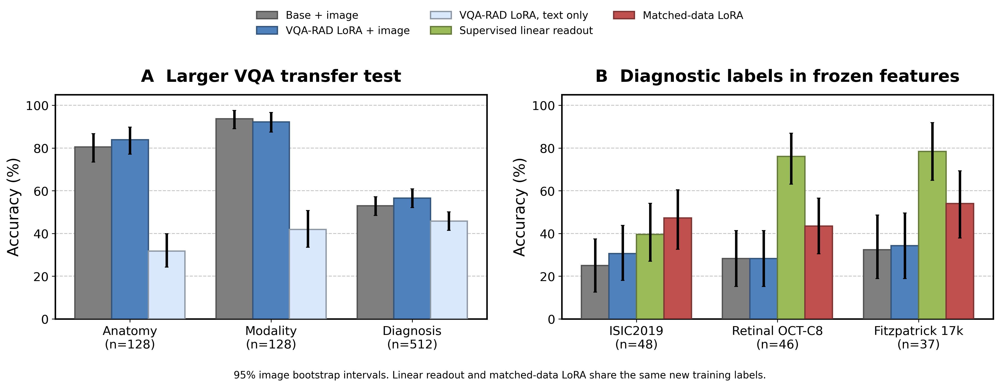

# 医学诊断标签的读出适配不足：OmniMedVQA 实验证据

## 核心结果与解释

在372张同标签影像上训练普通 LoRA、保持视觉编码器冻结，三个种子的131张留出图像准确率由原医学 LoRA 的 **30.79%** 提高到 **47.84%**，提升 **17.05** 个百分点（95%区间 **[7.38, 26.72]**）。相同初始基础模型为 **28.24%**。这一干预支持“诊断标签的语言端读出适配不足”是本轮性能不足的一项可改善因素。

在眼底 OCT 和皮肤照片的四分类测试中，冻结的 Qwen2-VL 视觉表示可以由一个受监督线性分类器读出诊断类别；现有 VQA-RAD LoRA 的语言问答输出明显较弱。两个读出差距的图像 bootstrap 95% 区间均高于零。皮肤镜结果的区间包含零，结论具有数据集差异。

本研究将“已经掌握图像信息”操作化为：固定视觉编码器的输出中存在能在独立图像测试集上预测诊断标签的信息。实验支持这种标签信息的可恢复性，并发现其与当前语言问答输出之间的差距。临床上充分的征象识别、对这些征象的理解以及最终诊断之间的因果关系，仍需要独立征象标注来识别。

## 1. 数据集与评测范围

使用 Hu 等人的 **OmniMedVQA，CVPR 2024**。作者从73个医学数据集构造多模态问答。论文及下载入口：

- [CVPR 2024 论文](https://openaccess.thecvf.com/content/CVPR2024/html/Hu_OmniMedVQA_A_New_Large-Scale_Comprehensive_Evaluation_Benchmark_for_Medical_LVLM_CVPR_2024_paper.html)
- [作者官方代码及下载说明](https://github.com/OpenGVLab/Multi-Modality-Arena/tree/main/MedicalEval)
- [作者发布的数据](https://huggingface.co/datasets/foreverbeliever/OmniMedVQA)

下载版本的73份官方标注实际包含 **127,995** 条问答。另下载带影像的重打包测试分片，并将其中 **17,919** 道题、**17,601** 张不同影像逐条核对：问题、四个选项、答案、图像路径均与官方标注完全一致。所有影像路径都存在于官方压缩包；抽查8张、覆盖8个来源，影像字节 SHA256 与官方原图完全一致。下载版本统计与论文统计采用各自口径；此处报告实际文件统计。

本轮预先固定1024道来源分层抽样题和128张影像上的成对任务。1024题结果属于该固定子集。模型为 Qwen2-VL-2B-Instruct，以及此前只在80张 VQA-RAD 训练影像上训练的普通 rank-8 LoRA，三个随机种子42/43/44。原视觉编码器冻结，最大128个视觉 token。VQA-RAD 训练图像与新影像池 SHA 重叠为零。

主指标为候选字母 A/B/C/D 的最高分选择准确率，另统计模型自由选择的第一个答案 token，大小写等价。本轮1024题上两种准确率完全一致。该评测协议与作者的全量榜单协议不同，数值用于本轮内部比较。

## 2. 大样本中复现的任务差异

| 任务 | 题数 | 原医学 LoRA：有图像 | 原医学 LoRA：去掉图像 | 图像贡献 / 百分点（95%区间） |
|---|---:|---:|---:|---:|
| 解剖识别 | 128 | 83.85% | 31.77% | +52.08 [42.45, 61.72] |
| 模态识别 | 128 | 92.19% | 41.93% | +50.26 [41.40, 59.11] |
| 诊断 | 512 | 56.58% | 45.83% | +10.74 [6.18, 15.62] |
| 病变分级 | 128 | 42.71% | 33.85% | +8.85 [-0.26, 18.23] |
| 其他生物属性 | 128 | 64.58% | 63.54% | +1.04 [-4.17, 6.25] |

解剖和模态任务从图像获得约50个百分点的增益；诊断任务获得10.74个百分点。这确认当前模型在不同医学任务中利用图像的程度差异很大。诊断和其他题目的问法、候选答案、信息需求不同，跨任务准确率差异本身无法独立确定机制。

在128张相同影像的成对任务中，种子42的结果如下。粗粒度任务包含42道解剖题、86道模态题：

| | 诊断答对 | 诊断答错 |
|---|---:|---:|
| 粗粒度任务答对 | 77 | 43 |
| 粗粒度任务答错 | 6 | 2 |

这组结果确认同一影像上存在“粗粒度判断正确、诊断错误”的病例。粗粒度正确只验证对应部位或模态，诊断所需征象的掌握程度仍需另测。

## 3. 关键定位：固定图像特征中的诊断类别可读出性

在数据读取和模型预测之前，按可用样本量确定三个数据来源，每个来源选择四个常见诊断类别。每类最多64张影像，确定性划分60%训练、20%验证、20%测试，同一图像 SHA 跨集合重叠为零。三个来源合计372张训练、127张验证、131张测试影像。

分类器输入为冻结视觉 merger 输出的 token 均值，1536维；输出为一个线性层。使用岭回归拟合四分类 one-hot 标签，正则系数只由验证集选择。无额外视觉模块、门控或手工诊断规则。打乱训练标签作为对照。

| 数据来源（测试图像数） | 基础模型语言输出 | 原医学 LoRA语言输出，三种子均值 | 冻结特征线性读出 | 打乱训练标签的读出 | 读出−原 LoRA / 百分点（95%区间） |
|---|---:|---:|---:|---:|---:|
| ISIC2019（48） | 25.00% | 30.56% | 39.58% | 20.83% | +9.03 [-9.03, 27.08] |
| Retinal OCT-C8（46） | 28.26% | 28.26% | 76.09% | 28.26% | +47.83 [30.43, 65.22] |
| Fitzpatrick 17k（37） | 32.43% | 34.23% | 78.38% | 24.32% | +44.14 [22.52, 64.86] |

眼底 OCT 和皮肤照片的结果表明，编码器输出中存在可泛化到这些留出图像的诊断类别信息，当前语言输出利用这些信息的效果较弱。皮肤镜的读出差距未获得明确统计支持。

线性读出接受了新类别的标注监督，原 VQA-RAD LoRA 在这些新类别上未接受本轮训练。因此，该差距同时包含新类别监督和输出路径适配的影响。

## 4. 同等标注数据的普通 LoRA 训练对照

使用与线性读出完全相同的372张影像及诊断类别标签，从原始 Qwen2-VL 权重训练普通 rank-8 LoRA。视觉编码器继续冻结，只更新语言模型 q/v 投影；alpha32，学习率1e-4线性衰减，3轮，批量8，微批4，答案字母加EOS的交叉熵。每个种子141次更新，三个种子共423次更新。模型选择仅使用127张验证影像，测试只评测选中的轮次。

该对照在观察到线性读出结果后启动，属于探索性后续验证。线性读出按来源分别拟合，LoRA联合训练三个来源；模型结构、损失和训练预算不同。

| 数据来源 | 原医学 LoRA | 同标签训练后的普通 LoRA | 提升 / 百分点（95%区间） | 新 LoRA去图像 |
|---|---:|---:|---:|---:|
| ISIC2019（48） | 30.56% | 47.22% | +16.67 [5.56, 28.47] | 27.08% |
| Retinal OCT-C8（46） | 28.26% | 43.48% | +15.22 [-5.07, 35.53] | 26.09% |
| Fitzpatrick 17k（37） | 34.23% | 54.05% | +19.82 [2.70, 36.04] | 31.53% |
| ALL（131） | 30.79% | 47.84% | +17.05 [7.38, 26.72] | 27.99% |

新 LoRA 的图像增益为 **+19.85** 个百分点，95%区间 **[9.16, 30.53]**；相对原 LoRA 的图像增益变化为 **+15.01** 个百分点，95%区间 **[4.06, 25.70]**。

同标签训练对照将“有没有相关类别监督”纳入了比较。提升和视觉增益应分别按上表及区间解释，结论限定于这三个来源的四分类任务。

以相同初始基础模型为对照，只训练语言端后的准确率提升为 **+19.59** 个百分点，95%区间 **[9.92, 29.26]**；图像贡献相对基础模型增加 **+17.56** 个百分点，95%区间 **[6.36, 28.25]**。该干预直接证明，在本任务和训练预算内，改变语言端的适配可以提高固定视觉表示的利用效果。

同标签的线性读出合计准确率 **63.36%**，新 LoRA 为 **47.84%**，差距 **+15.52** 个百分点，95%区间 **[4.58, 25.95]**。线性读出按来源单独拟合、LoRA联合训练的结构差异应纳入解释。

## 5. 结论边界与复现材料

本轮结果支持：在特定诊断分类数据上，冻结视觉表示含有可用的类别信息，而原语言问答输出存在读出差距。将这一发现扩展为“模型已经正确识别了充分的医学征象，却无法作出临床诊断”，仍需要征象级独立标注。

数据源来自分类数据集，题目由标签构造，部分题目要求组织类型或分期；本研究没有完成临床专家可回答性审核。数据缺少患者编号，SHA 独立无法保证患者独立；影像采集差异也可能被分类器利用。131张测试影像、每源四个选择类别，限定了外推范围。此实验没有直接比较 NLP 的同构任务，也无法据此断言该瓶颈为医学独有。

统计使用5000次图像聚类及种子重采样；多个问题、多个种子不作为额外独立患者。

原始选择、协议、逐题预测、训练日志、数据版本及校验见本目录：`selection.json`、`protocol.json`、`evaluation_protocol.json`、`predictions.jsonl`、`probe_predictions.jsonl`、`analysis_summary.json`、`adaptation_protocol.json`、`adaptation_predictions.jsonl`、`adaptation_summary.json`、`verification.json`、`dataset_revision.json`。所有模型计算与统计均在 SSH 服务器 `/data2/liyapeng_grp/program/LLMCL/analysis/omnimed_20261009` 完成。
