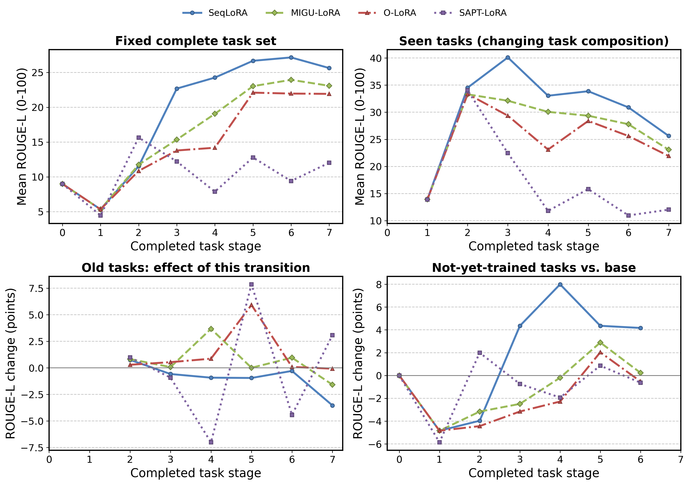

# 语言实验报告：示例、效果与指标

这里报告 T5-Large 在七个通用语言任务上连续学习，以及接着学习两个医学语言任务的效果。四方法均已完成；含图像的 Qwen2-VL 实验见 [summary_cv](../summary_cv/README.md)。

## 先看七个任务的真实示例

以下七条均来自 v2 固定 Test 划分，每任务选一条便于阅读的实例；它们不是模型预测，不代表整个任务难度。输入块是执行器生成的完整文本 prompt（尚未分词和截断），保留原始英文内容。中文说明仅用于本文阅读，不参与实际输入。

参考答案单独展示，运行时不会拼进测试 prompt。每条保留 task_id 和 instance_id，可在 `data/SuperNI_full/tasks/<task_id>.json` 的 Instances 中追溯。按下面原样保留上游标注，不手工修正答案。

### 1. Quoref：阅读理解答案生成

根据给定段落回答问题，通常需要解析人物或实体的指代；输出段落中的答案短语。

- task_id：`task002_quoref_answer_generation`
- instance_id：`task002-03cd1a02107146ff9f7f43b6f3e0b7e0`
- 数据用途：Test，属于该任务固定 500 条测试样本。

模型输入：

```text
Instruction: In this task, you're expected to write answers to questions involving multiple references to the same entity. The answer to the question should be unambiguous and a phrase in the paragraph. Most questions can have only one correct answer.

Input: Passage: In Bedrock, Slate International's vice president Cliff Vandercave and his secretary Miss Stone discuss their plan to swindle the company of its vast fortune and flee. As part of the plan, they would need one of the employees to be the scapegoat. Meanwhile, Fred Flintstone loans his best friend and neighbor Barney Rubble money so that he and his wife Betty can adopt a child. The agency pairs them up with a child named Bamm-Bamm, who can only pronounce his own name. Although Bamm-Bamm is initially difficult to control due to being raised by mastodons, and thus has super strength, he eventually warms up to his new family. Barney vows to repay his friend Fred for his debt of gratitude. Despite his mother-in-law Pearl Slaghoople's objections, Fred's wife Wilma remains supportive of Fred's decision to help Barney. Fred promises he will prove himself to her one day. 
Question: Who does Fred promise to prove himself to?

Response:
```

参考答案：

```text
Pearl Slaghoople.
```

ROUGE-L 为主，同时关注 EM/token-F1。

### 2. XSUM：新闻摘要

把一篇新闻压缩为一句话摘要，保留核心内容。

- task_id：`task1290_xsum_summarization`
- instance_id：`task1290-e5d95821fd564bb79a370583f1ab1441`
- 数据用途：Test，属于该任务固定 500 条测试样本。

模型输入：

```text
Instruction: In this task, you are given an article. Your task is to summarize the article in a sentence.

Input: 21 March 2017 Last updated at 14:25 GMT
It's a new craze that is sweeping the internet, where you try to blow one cup into another.
We went to a school to meet some of you guys to find out a bit more about it.
Can you do it?

Response:
```

参考答案：

```text
You might have heard of the bottle-flipping challenge, but how about the cup-blowing challenge?
```

主指标 ROUGE-L；合理改写也可能与参考词面不同。

### 3. EVALution：词汇关系抽取

从描述中生成“词1 关系 词2”，本例表达 dog 属于 pet。

- task_id：`task1510_evalution_relation_extraction`
- instance_id：`task1510-73380634b3bb486ebc3cbdf191fb1880`
- 数据用途：Test，属于该任务固定 500 条测试样本。

模型输入：

```text
Instruction: Given a phrase describing the relationship between two words, extract the words and the lexical relationship between them. The relation has to be of the type 'MemberOf', 'MadeOf', 'Synonym', 'Entails', 'HasA', 'HasProperty', 'PartOf', 'Antonym' or 'IsA'. The output should have the format: word1 relation word2.

Input: dog is a kind of pet

Response:
```

参考答案：

```text
dog IsA pet
```

主指标 ROUGE-L；关系词和两端实体均参与评分，未另设结构化关系准确率。

### 4. PersonaChat：对话回复生成

结合人物设定和对话历史，生成下一句话。

- task_id：`task1729_personachat_generate_next`
- instance_id：`task1729-500928b0b3774231a851e5ed3943af35`
- 数据用途：Test，属于该任务固定 500 条测试样本。

模型输入：

```text
Instruction: Your task is to generate the next utterance in a given dialogue. You will be given a few sentences describing the personality of the person who is making the dialogue, and a history of the dialogue after that. Each line in the history is said by one of the two participants in the conversation.

Input: Personality: I am a couch potato.
I do not have a job.
I love the walking dead.
I love comics.
Chat history: -Hi, hows life treating you?
 -Good so far.. how about you.

Response:
```

参考答案：

```text
I'm just chilling, riding the couch.
```

主指标 ROUGE-L；开放对话有多种合理回复，低词面分不必然代表回复不合理。

### 5. Reddit TIFU：帖子摘要

将个人经历概括为一两句话，提炼导致尴尬或失误的核心事件。

- task_id：`task511_reddit_tifu_long_text_summarization`
- instance_id：`task511-631f53eedb274a09bf754c98114fd4bc`
- 数据用途：Test，属于该任务固定 500 条测试样本。

模型输入：

```text
Instruction: In this task, you are given a Reddit post as a text. Your task is to generate a short summary for this text. The summary must include a situation which caused humor. The summary should be one or two sentences long.

Input: Text: (this happened about an hour ago)it's our second night in our new house, as it's cold outside i decided to light the fireplace.  never having used a gas fireplace before,  i turned on the key all the way up and then stood for about 30 before realizing i had to ignite it with a lighter.    well, i no longer need a haircut....nor have any eyebrows or am hair.

Response:
```

参考答案：

```text
lit a fireplace on blast, burned off most of my facial hair, eyebrows, and the top of my hairline.
```

主指标 ROUGE-L；参考答案保留原始帖子风格。

### 6. SciQ：科学问答

直接回答一个科学问题，本例询问昆虫卵孵化出什么。

- task_id：`task591_sciq_answer_generation`
- instance_id：`task591-6d6f5d55d0b542bba75e1039981f2969`
- 数据用途：Test，属于该任务固定 500 条测试样本。

模型输入：

```text
Instruction: Given a scientific question, generate a correct answer to it.

Input: What emerges from an insect egg?

Response:
```

参考答案：

```text
larva
```

ROUGE-L 为主，同时关注 EM/token-F1；参考答案 larva 意为幼虫。

### 7. GLUCOSE：因果事件关系生成

根据短故事及指定句子，生成该事件导致或促成的后续事件关系。

- task_id：`task748_glucose_reverse_cause_event_detection`
- instance_id：`task748-14a34569dc384154b5ea8577db1bec0b`
- 数据用途：Test，属于该任务固定 500 条测试样本。

模型输入：

```text
Instruction: In this task, you will be given a short story. One sentence from the story is chosen. Consider the events that happen after that sentence. Is any of them directly caused by it, or is made possible by it? You should write your answer in the form " A >causes/enables> B". Try to use phrases and sentences from the story to compose your answer when possible. Do not change the main selected sentence in your answer.

Input: story: I went to Texas last week. It was very fun. We had bbq food. It tasted very good. I wanted to go back.
 selected sentence: It was very fun.

Response:
```

参考答案：

```text
Texas was very fun >Causes/Enables> I want to go back
```

主指标 ROUGE-L；没有单独的因果逻辑判定器，文本匹配不保证逻辑正确。


完整训练过程、矩阵热图和按论文口径重算的 MFT / MFN / MAA 等指标见 [全过程报告](learning_process.md)。



## 本轮大体效果

| 方法 | 最终均分 AP ↑ | 遗忘幅度 ↓ | BWT ↑ | FWT ↑ |
|---|---:|---:|---:|---:|
| SeqLoRA | 25.634 | 5.352 | -4.943 | 2.340 |
| MIGU-LoRA | 23.084 | 1.944 | 1.213 | -2.864 |
| O-LoRA | 21.926 | 0.297 | 4.603 | -3.882 |
| SAPT-LoRA | 12.030 | 0.810 | 0.969 | -0.652 |

SeqLoRA 的最终平均分最高，O-LoRA 的遗忘幅度最小。SAPT-LoRA 的遗忘较小，但平均分也明显较低，因此应同时看最终能力与保留能力。这里只报告一个种子、一个顺序和每任务 1 轮的试跑。

完整逐任务分数与阶段变化见 [T5 七任务结果](t5_large_comparison.md)。

### 接着学习医学语言后的变化

| 方法 | 原七任务均分变化 | 医学任务均分变化 |
|---|---:|---:|
| SeqLoRA | +0.638 | +9.654 |
| MIGU-LoRA | +1.758 | +2.658 |
| O-LoRA | +0.004 | -1.351 |
| SAPT-LoRA | -4.104 | -0.474 |

变化采用 0–100 ROUGE-L 的分数点。SeqLoRA、MIGU-LoRA 在这轮医学任务上提高；O-LoRA、SAPT-LoRA 没有获得平均提升。这里比较的是同一个模型续训前后，医学任务与旧任务分开平均。详情见 [医学续训报告](medical_continuation.md)。

## 指标定义

### 一条答案怎么计分

测试时模型只看到任务说明和输入，参考答案只交给评分程序。每任务有固定的 500 条测试实例，模型逐条生成，评分后在任务内平均。多参考答案时，每项指标分别取与各参考比较的最大值；不会把多个参考算成多条测试样本。

### ROUGE-L：共同主指标

ROUGE-L 使用生成文本与参考文本的最长公共子序列（LCS）。它保留词的相对顺序，允许中间存在其他词。

设生成文本分词后有 $m$ 个词，参考有 $n$ 个词，LCS 长度为 $L$：

$$
\begin{aligned}
P_{\mathrm{LCS}} &= \frac{L}{m}, & R_{\mathrm{LCS}} &= \frac{L}{n},\\
\operatorname{ROUGE-L} &= 100\cdot\frac{2P_{\mathrm{LCS}}R_{\mathrm{LCS}}}{P_{\mathrm{LCS}}+R_{\mathrm{LCS}}}.
\end{aligned}
$$

无匹配时记 0。大小写、标点和词干处理采用固定规则，各方法一致。

ROUGE-L 衡量文本重合，不是答案正确的概率。对话或摘要可能有多个合理表达，即使意思正确也可能得分较低。

### EM：完全匹配

EM（Exact Match）用于补充观察问答是否准确命中参考答案：

1. 转成小写；
2. 删除 ASCII 标点；
3. 删除英文冠词 a、an、the；
4. 合并空白；
5. 规范化后完全相同记 100，否则记 0。

$$
\mathrm{EM}(\widehat y,y)=100\cdot\mathbf{1}\!\left[\nu(\widehat y)=\nu(y)\right],
$$

其中 $\nu$ 表示上述文本归一化。

任务级 EM 是这些 0/100 分的平均值，可解释为该规范化规则下的完全匹配比例。

### token-F1：答案词覆盖情况

这里的 token 是上述问答规范化后按空白分出的词，不是模型 tokenizer 的子词。设 C 为生成答案与参考答案 token 多重集合的交集数量；重复词按出现次数计数：

$$
\begin{aligned}
P_{\mathrm{tok}} &= \frac{C}{|\widehat{Y}|}, & R_{\mathrm{tok}} &= \frac{C}{|Y|},\\
F_{1,\mathrm{tok}} &= 100\cdot\frac{2P_{\mathrm{tok}}R_{\mathrm{tok}}}{P_{\mathrm{tok}}+R_{\mathrm{tok}}}.
\end{aligned}
$$

没有交集记 0；两边都为空记 100，仅一边为空记 0。该指标不要求词序一致。当前计分器会保存三项分数；主比较使用 ROUGE-L，Quoref 和 SciQ 重点补充 EM/token-F1，不把三种分数混合求平均。

### 单条评分示意：不是本轮模型预测

假设问题是“植物在光合作用中吸收什么气体？”，参考答案为 `carbon dioxide`：

| 人工构造的预测 | ROUGE-L | EM | token-F1 |
|---|---:|---:|---:|
| carbon dioxide | 100.00 | 100.00 | 100.00 |
| carbon | 66.67 | 0.00 | 66.67 |
| oxygen | 0.00 | 0.00 | 0.00 |

这些数值已用本仓库实际计分器核对，只用于说明算法。真实模型成绩以运行目录中的预测和结果为准。

## 持续学习矩阵

对任务 j，在训练阶段 i 结束时生成其全部 500 条测试答案，得到：

$$
R_{i,j}=\frac{1}{N_j}\sum_{n=1}^{N_j}\max_{y\in\mathcal{Y}_{j,n}}\operatorname{ROUGE-L}\!\left(\widehat{y}_{i,j,n},y\right),\qquad N_j=500.
$$

设 $T=7$，$\mathbf{R}\in[0,100]^{8\times7}$。矩阵有 8 行、7 列：第 0 行是未经任务训练的基座，后面七行是各阶段；列对应当前运行的任务顺序。成绩全部采用 0–100 尺度。测试对象一直是同一批样本，阶段之间不重新抽样。

另定义：

- $b_j=R_{0,j}$：基座在任务 j 上的初始分数。
- $R_{j,j}$：刚学完任务 j 时，在该任务上的分数。
- $R_{T,j}$：学完全部任务后，在任务 j 上的最终分数。

公式中的 j 是运行顺序里的位置，不是任务名称中的数字编号。

## 持续学习指标的具体定义

### AP：Average Performance，最终平均表现 ↑

$$
\mathrm{AP}=\frac{1}{T}\sum_{j=1}^{T}R_{T,j}.
$$

看模型全部学完后还能完成各个任务的平均水平。七个任务同权，不按文章长度或生成 token 数加权。当前 AP 是平均 ROUGE-L，不是分类准确率或 Precision–Recall 曲线面积。

### F.Rate：Forgetting Rate，平均遗忘幅度 ↓

$$
\mathrm{F.Rate}=\frac{1}{T-1}\sum_{j=1}^{T-1}\left(\max_{j\le i\le T-1}R_{i,j}-R_{T,j}\right).
$$

对每个旧任务，取“从学会它开始，到最终阶段之前”的历史最好成绩，再减去最终成绩，最后对前 T−1 个任务平均。最后一个任务没有后续任务，所以不计入。

虽然名称含 Rate，这里是分数下降的百分点，不除以历史最好成绩，也不截断负数。若最终成绩比此前最好成绩还高，该任务的遗忘项可以是负数。

### BWT：Backward Transfer，后向迁移 ↑

$$
\mathrm{BWT}=\frac{1}{T-1}\sum_{j=1}^{T-1}\left(R_{T,j}-R_{j,j}\right).
$$

衡量后续任务学习对旧任务的影响。正数表示旧任务提高，负数表示下降。

BWT 与 F.Rate 的参照点不同：BWT 比较“刚学完时”，F.Rate 比较“历史最好时”，一般不能直接认为二者互为相反数。

### FWT：Forward Transfer，尚未训练任务上的前向迁移 ↑

采用 [GEM（2017）§2 式 (4)](https://arxiv.org/abs/1706.08840) 的标准定义，仅需主线：

$$
\mathrm{FWT}_{\mathrm{GEM}}=\frac{1}{T-1}\sum_{j=2}^{T}\left(R_{j-1,j}-b_j\right),\qquad b_j=R_{0,j}.
$$

在还没有训练任务 j 时，比较“已学前面任务的模型”和“初始基座”在 j 上的成绩。第一任务没有先前学习经历，所以排除。

本轮将 GEM 中的初始模型对应到固定 T5-Large 基座，任务分数统一使用 ROUGE-L。正数表示前序学习帮助了未来任务，负数表示负迁移。七任务共有六个迁移项，分母为 6；无需独立训练任务，也不额外报告重复的 FWT_zero_shot 列。

SAPT §5.1.2 另用了训练后对独立单任务训练的比较，本仓库此前误将它作为默认口径，现已替换。历史结果保留评价协议标识，不能混算。

缺少必要矩阵项时，相关指标记 N/A，不填零、不缩小分母。当前代码只在完整矩阵上计算这些指标。AP 用分表示；其他差值用百分点表示。

## 持续学习得分示意

下面为便于手算，假设只有两个任务 A、B。这是人工构造示例，不是实际七任务结果。

| 阶段 | 测试 A | 测试 B |
|---|---:|---:|
| 初始基座 | 20 | 15 |
| 学完 A | 70 | 25 |
| 接着学完 B | 60 | 80 |

仅用这张主线矩阵即可得到：

| 指标 | 计算 | 分数 |
|---|---|---:|
| AP | (60+80)/2 | 70 |
| F.Rate | 70−60 | 10 |
| BWT | 60−70 | −10 |
| FWT | 25−15 | 10 |

本例中 F.Rate 和 BWT 恰好互为相反数，因为 A 只有一个最终阶段前的已训练成绩，不能推广到更长任务序列。

最终多次重复实验的建议统计规则：先逐运行计算指标，每个 seed 再平均两个顺序，最后对三个 seed 的结果求均值和样本标准差（ddof=1）。不能先平均矩阵再计算含 max 的 F.Rate。当前汇总脚本仅列独立运行，尚不自动生成该多种子统计。


## 实现流程与复现

实现使用 `rouge-score==0.1.2` 的 `rougeL`、默认英文分词和 `use_stemmer=True`，不是 `rougeLsum`；大小写、标点和词干处理遵循该库。 指标实现位于 [exp/common.py](../exp/common.py)。完整设置见 [实验协议](../rules/001_experiment_protocol.md)，任务及划分指纹见 [数据清单](../rules/001_data_manifest.json)。

### 汇总文件与刷新命令

- [collect.py](collect.py)：读取 `exp/result/` 中各次运行的配置、状态和最终指标。
- [results.csv](results.csv)：便于程序或表格软件读取的总表。
- [results.md](results.md)：便于直接查看的总表。
- [run_status.md](run_status.md)：本轮四个方法的运行汇报；技术实现与复现命令见 [exp/README.md](../exp/README.md)。
- 本文：解释分数含义，并展示每个任务的真实测试样本。

在项目根目录执行：

```bash
.conda-env/bin/python summary/collect.py
```

当前总表每一行是一轮独立尝试，不是多种子均值。本轮包含 SeqLoRA、O-LoRA、MIGU-LoRA、SAPT-LoRA，均为 order_1、seed 42、每任务 1 epoch，每个方法仅运行一条持续学习主线。SAPT 为包含生成反思的统一协议适配，额外计算单独记录。评价口径为 `cl_standard_fwt_v1`；旧口径标记 `legacy_sapt_fwt`，不能直接比较两种 FWT。功能验证的 `smoke=true` 结果被排除。未完成或失败运行显示状态，指标为 N/A，不能当作零分。总表是生成时的快照，任务完成后由启动器更新，也可以手动刷新。

比较时应核对模型及数据版本、精度、任务顺序、训练预算和评价口径；完整指纹见 CSV 和运行目录。不能把首轮单种子成绩称为最终“两顺序×三种子”统计。


### 原始预测与运行目录

每次运行位于：

```text
exp/result/<protocol>/<run_label>/<run_id>/
  config.json
  status.json
  metrics.json
  continual/
    score_matrix.json
    predictions/stage_00/<task_id>.jsonl
    predictions/stage_01/<task_id>.jsonl
    ...
```

- `stage_00` 是基座初测，`stage_01` 是学完第一个任务后的测试，以此类推。
- 每条预测保存 instance_id、生成答案、参考答案及三项样本分数。
- `continual/metrics.json` 从完整矩阵直接计算 AP、F.Rate、FWT、BWT。
- 主线成功完成后，顶层 `metrics.json` 记录四项指标及评价协议，随后更新总表。
- 阶段进行中的分数只用于观察进度，不能当作已经完成的最终指标。

本文的示例和手算不会写进结果表，也不用于调整训练参数、挑选检查点或修改测试集。
