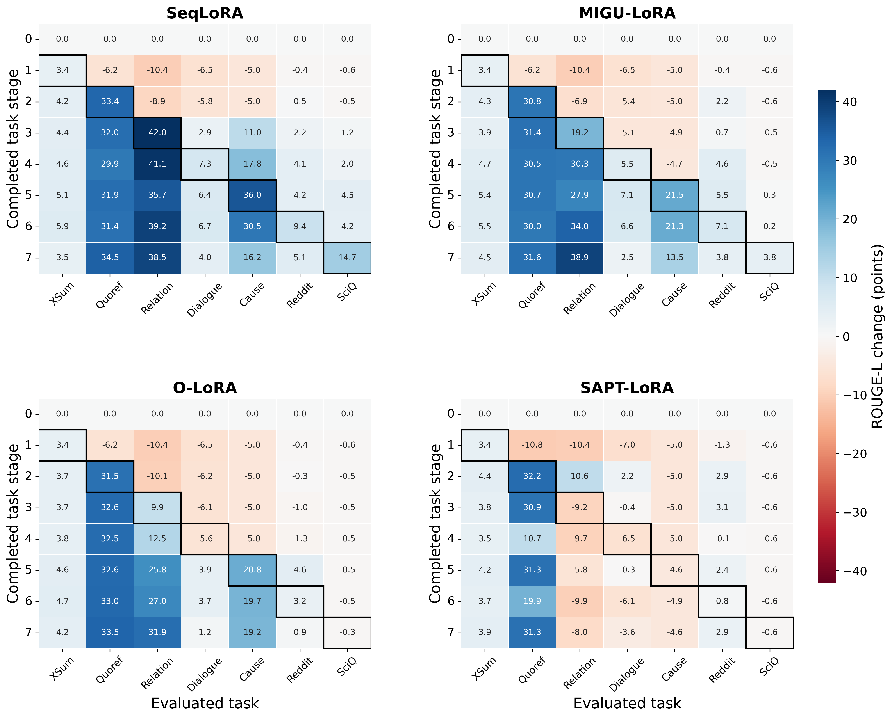

# T5 七任务学习全过程

以同一测试集贯穿基线与全部学习阶段，直接展示“什么时候学会、在哪里退化”。分数都是 ROUGE-L（0–100），差值单位为分数点。

## 先看全过程


左上固定全部任务，便于观察整体变化；右上只看已学任务，其任务构成会改变；左下在同一旧任务集合上比较本次更新前后；右下展示尚未学习任务相对基座的变化。没有旧任务/未来任务时留空，不填零。

## 按论文口径重算

| 方法 | 初始固定均分 | MFT 刚学完 ↑ | MFN / AP 最终 ↑ | MAA 全过程 ↑ | 遗忘幅度 ↓ | BWT ↑ | GEM FWT ↑ |
|---|---:|---:|---:|---:|---:|---:|---:|
| SeqLoRA | 8.991 | 29.871 | 25.634 | 30.286 | 5.352 | -4.943 | 2.340 |
| MIGU-LoRA | 8.991 | 22.045 | 23.084 | 27.091 | 1.944 | 1.213 | -2.864 |
| O-LoRA | 8.991 | 17.980 | 21.926 | 25.100 | 0.297 | 4.603 | -3.882 |
| SAPT-LoRA | 8.991 | 11.200 | 12.030 | 17.289 | 0.810 | 0.969 | -0.652 |

MFT、MFN、MAA 对应 MLLM-CL 的计算结构；本实验以生成任务 ROUGE-L 代替该论文的任务准确率，不能直接比较论文数值。EM 和 Token F1 的同口径重算也保存在 CSV。SAPT 原文 FWT 与 GEM 不同，需要独立单任务训练对照，这里记 N/A。

## 各任务相对基线的变化



每个格子是该阶段在一个固定任务上相对基座的分数变化；蓝色为提高，红色为下降。黑框是该任务刚学完的阶段。所有方法共享同一颜色范围。

## 阶段与完整矩阵

| 阶段 | 本阶段学习的任务 |
|---:|---|
| 0 | 初始基座 |
| 1 | XSum |
| 2 | Quoref |
| 3 | Relation |
| 4 | Dialogue |
| 5 | Cause |
| 6 | Reddit |
| 7 | SciQ |

### SeqLoRA

| 阶段 | XSum | Quoref | Relation | Dialogue | Cause | Reddit | SciQ |
|---:|---:|---:|---:|---:|---:|---:|---:|
| 0 | 10.489 | 20.989 | 10.390 | 7.363 | 5.018 | 8.058 | 0.628 |
| 1 | 13.932 | 14.813 | 0.000 | 0.904 | 0.000 | 7.685 | 0.000 |
| 2 | 14.684 | 54.369 | 1.483 | 1.524 | 0.000 | 8.543 | 0.080 |
| 3 | 14.902 | 52.990 | 52.421 | 10.300 | 16.021 | 10.278 | 1.876 |
| 4 | 15.114 | 50.929 | 51.496 | 14.628 | 22.831 | 12.208 | 2.648 |
| 5 | 15.631 | 52.889 | 46.069 | 13.769 | 40.993 | 12.259 | 5.142 |
| 6 | 16.389 | 52.342 | 49.606 | 14.076 | 35.494 | 17.435 | 4.797 |
| 7 | 14.019 | 55.450 | 48.897 | 11.339 | 21.230 | 13.187 | 15.319 |

### MIGU-LoRA

| 阶段 | XSum | Quoref | Relation | Dialogue | Cause | Reddit | SciQ |
|---:|---:|---:|---:|---:|---:|---:|---:|
| 0 | 10.489 | 20.989 | 10.390 | 7.363 | 5.018 | 8.058 | 0.628 |
| 1 | 13.932 | 14.813 | 0.000 | 0.904 | 0.000 | 7.685 | 0.000 |
| 2 | 14.756 | 51.835 | 3.440 | 1.948 | 0.000 | 10.259 | 0.000 |
| 3 | 14.346 | 52.385 | 29.624 | 2.237 | 0.077 | 8.721 | 0.080 |
| 4 | 15.170 | 51.537 | 40.671 | 12.883 | 0.326 | 12.686 | 0.120 |
| 5 | 15.841 | 51.669 | 38.275 | 14.494 | 26.488 | 13.579 | 0.890 |
| 6 | 15.977 | 50.941 | 44.359 | 13.988 | 26.298 | 15.167 | 0.864 |
| 7 | 15.038 | 52.619 | 49.324 | 9.823 | 18.516 | 11.886 | 4.384 |

### O-LoRA

| 阶段 | XSum | Quoref | Relation | Dialogue | Cause | Reddit | SciQ |
|---:|---:|---:|---:|---:|---:|---:|---:|
| 0 | 10.489 | 20.989 | 10.390 | 7.363 | 5.018 | 8.058 | 0.628 |
| 1 | 13.932 | 14.813 | 0.000 | 0.904 | 0.000 | 7.685 | 0.000 |
| 2 | 14.224 | 52.491 | 0.311 | 1.152 | 0.000 | 7.730 | 0.080 |
| 3 | 14.186 | 53.599 | 20.315 | 1.279 | 0.000 | 7.083 | 0.080 |
| 4 | 14.338 | 53.493 | 22.863 | 1.763 | 0.000 | 6.782 | 0.080 |
| 5 | 15.070 | 53.605 | 36.173 | 11.301 | 25.808 | 12.644 | 0.113 |
| 6 | 15.166 | 54.003 | 37.429 | 11.085 | 24.714 | 11.274 | 0.109 |
| 7 | 14.663 | 54.488 | 42.285 | 8.596 | 24.221 | 8.946 | 0.280 |

### SAPT-LoRA

| 阶段 | XSum | Quoref | Relation | Dialogue | Cause | Reddit | SciQ |
|---:|---:|---:|---:|---:|---:|---:|---:|
| 0 | 10.489 | 20.989 | 10.390 | 7.363 | 5.018 | 8.058 | 0.628 |
| 1 | 13.902 | 10.207 | 0.000 | 0.376 | 0.000 | 6.719 | 0.000 |
| 2 | 14.887 | 53.189 | 20.995 | 9.533 | 0.000 | 10.916 | 0.000 |
| 3 | 14.328 | 51.903 | 1.170 | 6.923 | 0.000 | 11.186 | 0.000 |
| 4 | 14.011 | 31.674 | 0.686 | 0.831 | 0.000 | 7.908 | 0.000 |
| 5 | 14.716 | 52.251 | 4.606 | 7.082 | 0.451 | 10.409 | 0.000 |
| 6 | 14.212 | 40.852 | 0.488 | 1.226 | 0.163 | 8.856 | 0.000 |
| 7 | 14.434 | 52.293 | 2.364 | 3.785 | 0.400 | 10.936 | 0.000 |

## 指标定义与公式

设 $R_{s,j}$ 是学完第 $s$ 个任务后的任务 $j$ 得分，$R_{0,j}$ 为基座。任务 $j$ 的刚学完分数位于 $R_{j,j}$。

$$
\begin{aligned}
\mathrm{MFT} &= \frac{1}{T}\sum_{j=1}^{T} R_{j,j},\\
\mathrm{MFN} &= \frac{1}{T}\sum_{j=1}^{T} R_{T,j},\\
\mathrm{MAA} &= \frac{1}{T}\sum_{s=1}^{T}\left(\frac{1}{s}\sum_{j=1}^{s}R_{s,j}\right).
\end{aligned}
$$

MFT 是刚学完各任务的平均分，不保证是真正的上界；后续学习也可能让旧任务更好。MFN 与此处 AP 相同，MAA 汇总整个学习过程。

$$
\begin{aligned}
A_s^{\mathrm{fixed}} &= \frac{1}{T}\sum_{j=1}^{T}R_{s,j},\\
S_s^{\mathrm{old}} &= \frac{1}{s-1}\sum_{j=1}^{s-1}(R_{s,j}-R_{s-1,j}),\quad s\ge 2,\\
G_s^{\mathrm{new}} &= R_{s,s}-R_{s-1,s},\\
U_s &= \frac{1}{T-s}\sum_{j=s+1}^{T}(R_{s,j}-R_{0,j}),\quad s<T.
\end{aligned}
$$

这里的旧任务切换冲击固定了比较的任务集合，避免新任务加入均值造成构成变化；MedCL-Bench 的原文另报告相邻已学任务平均分的差，原口径的差值也保留在过程 CSV 的 `seen_mean_transition` 列。`stage_forgetting` 记录每阶段旧任务历史最好分至当阶段的平均下降。未来任务集合仍随阶段变化，应配合逐任务曲线阅读。

## 来源、实现与重算

[论文指标对照](../paper/evaluation_and_process.md) 逐项说明可复原和缺少对照的项目。一个种子无法重建多种子标准差；没有 oracle、外部 OOD 测试和中间激活时，相关项目标 N/A，不能从最终数字反推。

精确数据及指标在本目录的过程 JSON / CSV，绘图不做平滑或填补。300 DPI PNG 位于 `sample/`，矢量 PDF 位于 `summary_cv/figures/`。

```bash
.vision-env/bin/python summary_cv/process.py
.vision-env/bin/python summary_cv/reconstruct_metrics.py
.plot-env/bin/python summary_cv/plot_process.py
```
