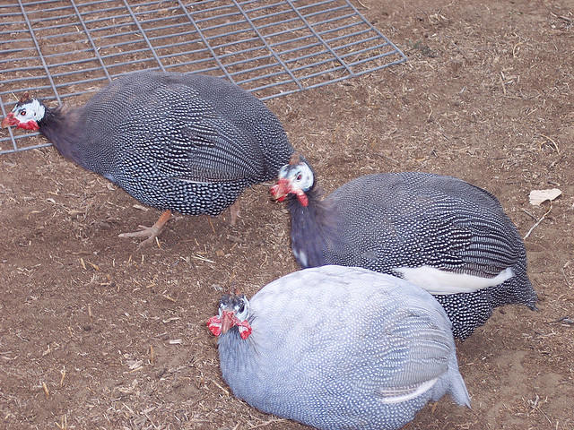
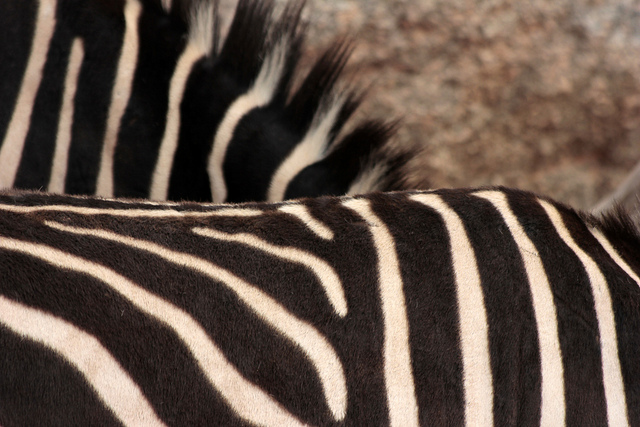

# 各任务与图像答案类别的真实示例

每个任务取固定测试顺序的第一条；图像答案类别再各取第一条。选择不依赖模型得分。回答来自保存的预测文件，未人工改写。

“刚学完”指该任务训练完成后的阶段；“最终”指九任务全部学习后的阶段。图像问答保留真实图片链接；文本保持原始英文。

## 1. 通用语言：新闻摘要（XSum）

任务：`task1290_xsum_summarization`；实例：`task1290-fdb2129f72f349019654d8b07a72c90b`。

输入：

````text
Instruction: In this task, you are given an article. Your task is to summarize the article in a sentence.

Input: Cross, who has admitted to the murders, said he hoped to "die a martyr" after the verdict was announced.
Jurors still need to decide whether he should get the death penalty.
Cross, 74, was also convicted of three counts of attempted murder for firing indiscriminately at people during the fatal shooting in April 2014.
He shot dead Dr William Lewis Corporon, 69, and his 14-year-old grandson Reat Griffin Underwood, and Terri LaManno, 53, outside two separate Jewish centres.
Although he has admitted to the killings, Cross pleaded not guilty at trial. He said he was motivated to kill Jews because he believes they have too much power.
None of the victims of the Kansas City shooting was Jewish.
Before the shooting, Cross founded several white supremacist groups and later ran twice for elected office on a white power platform.

Response:

````

参考答案（去除完全重复的文字）：

````text
White supremacist Frazier Glenn Cross has been found guilty of murdering three people at two Jewish sites in Kansas City last year.
````

### SeqLoRA

### MIGU-LoRA

### O-LoRA

### SAPT-LoRA

## 2. 通用语言：阅读理解（Quoref）

任务：`task002_quoref_answer_generation`；实例：`task002-0c57e29b81724af1acd6f4265c9b2bcd`。

输入：

````text
Instruction: In this task, you're expected to write answers to questions involving multiple references to the same entity. The answer to the question should be unambiguous and a phrase in the paragraph. Most questions can have only one correct answer.

Input: Passage: It was probably William the Conqueror who gave the city and its castle to Bishop Odo of Bayeux, the king's half brother. On William's death in September 1087 his territories were divided between his two sons. Robert, the elder, inherited the title of Duke of Normandy and William Rufus became King of England. A significant number of Norman barons objected to dividing Normandy and England, and Bishop Odo supported Robert's claim to the English throne. Several others, including the earls of Northumberland and Shrewsbury and the Bishop of Coutances came out in support of Robert. Odo prepared Rochester Castle for war and it became one of the headquarters of the rebellion. Its position in Kent made it a suitable base for raids on London and its garrison could harry William's forces in the county. William set off from London and marched towards Rochester to deal with the threat. Before he arrived, news reached the king that Odo had gone to Pevensey Castle, which was under the control of Robert, Count of Mortain. William turned away from Rochester and seized Pevensey. The captured Odo was forced to swear to hand over Rochester to William's men. The king despatched a force with Odo in tow to demand Rochester's surrender. Instead of yielding, the garrison sallied and captured the entire party. In response William laid siege to the city and castle. Contemporary chronicler Orderic Vitalis recorded that the siege began in May 1088. Two siege-castles were built to cut off the city's supply lines and to protect the besiegers from sorties. Conditions within the city were dire: disease was rampant, exacerbated by the heat and flies. The garrison ultimately capitulated and terms were agreed. Odo, Eustace, Count of Boulogne, and Robert de Belleme, son of the Earl of Shrewsbury, were allowed to march away with their weapons and horses but their estates in England were confiscated. This marked the end of the castle's role in the rebellion, and the fortification was probably abandoned shortly afterwards. The siege-castles were abandoned after the conclusion of the siege and have since vanished.After the abandonment of Rochester's first castle it was replaced by another on the current site, in the south-west corner of the town walls. Founded between 1087 and 1089, some parts of the castle survive although it has been much altered by use and reuse in subsequent centuries. William the Conqueror had granted Lanfranc, Archbishop of Canterbury, the manor of Haddenham in Buckinghamshire – which as of the Domesday Survey had an annual income of £40 – for the duration of his life. In turn, the archbishop had granted the manor to Rochester's monks, so on the Conqueror's death Lanfranc and Gundulf, who was appointed Bishop of Rochester in 1077, had to appeal for reconfirmation of the original grant from the new king. William Rufus demanded £100 in exchange for confirmation of the grant. The two bishops felt such a sum was beyond their means and sought a compromise. Instead it was agreed that Gundulf would build a new stone castle at Rochester. Initially the two bishops were concerned that the cost would exceed the king's original request and that they would be responsible for the castle's upkeep. However Henry, Earl of Warwick, convinced them that a castle suitable for the king could be constructed for £40 and that following its completion the castle would be handed over to someone else. The actual cost to Gundulf was £60. The bishop was a skilled architect and supervised the construction of the Tower of London's eponymous White Tower on behalf of William the Conqueror. Gundulf's castle was adjacent to Rochester Cathedral. According to archaeologist Oliver Creighton, when castles were positioned close to churches or cathedrals it suggested a link between the two, and in this case both were owned by the Bishop of Rochester. Often the same craftsmen and architects would work on these closely related buildings, leading to similarities in some of their features. Along with Durham and Old Sarum, Rochester is one of the best examples of a closely linked castle and religious building. 
Question: Where was the castle William laid siege to?

Response:

````

参考答案（去除完全重复的文字）：

````text
Rochester.
````

该输入在模型中已截断；实际输入 token 和 chat prompt 完整保存在 `examples.json`。

### SeqLoRA

### MIGU-LoRA

### O-LoRA

### SAPT-LoRA

## 3. 通用语言：关系抽取

任务：`task1510_evalution_relation_extraction`；实例：`task1510-5f9d683cda37406b8581222d07f79df2`。

输入：

````text
Instruction: Given a phrase describing the relationship between two words, extract the words and the lexical relationship between them. The relation has to be of the type 'MemberOf', 'MadeOf', 'Synonym', 'Entails', 'HasA', 'HasProperty', 'PartOf', 'Antonym' or 'IsA'. The output should have the format: word1 relation word2.

Input: radio can be used as the opposite of tv

Response:

````

参考答案（去除完全重复的文字）：

````text
radio Antonym tv
````

### SeqLoRA

### MIGU-LoRA

### O-LoRA

### SAPT-LoRA

## 4. 通用语言：对话续写（PersonaChat）

任务：`task1729_personachat_generate_next`；实例：`task1729-53143860f49c4b868f90de7fd8baa281`。

输入：

````text
Instruction: Your task is to generate the next utterance in a given dialogue. You will be given a few sentences describing the personality of the person who is making the dialogue, and a history of the dialogue after that. Each line in the history is said by one of the two participants in the conversation.

Input: Personality: I try to limit how much I eat.
I whine a lot.
I've a golden retriever puppy.
I do not have a job and sit on the couch all day.
Chat history: -Hi! how are you? Do you have any pets?
 -I am good I do not have pets what about you.
 -My 1 golden retriever. Its a puppy!
 -So cute where do you live.
 -Denver, Co. what about you?
 -Canada but my family is from Japan.
 -Wow, very diverse. I don't go further than my couch really. Sit here all day.
 -That's no fun get out and see the world.

Response:

````

参考答案（去除完全重复的文字）：

````text
I like being at home with the puppy. I eat a lot and should really limit that.
````

### SeqLoRA

### MIGU-LoRA

### O-LoRA

### SAPT-LoRA

## 5. 通用语言：因果推理（GLUCOSE）

任务：`task748_glucose_reverse_cause_event_detection`；实例：`task748-2f188cfafd6043ad86d7806cba4a41da`。

输入：

````text
Instruction: In this task, you will be given a short story. One sentence from the story is chosen. Consider the events that happen after that sentence. Is any of them directly caused by it, or is made possible by it? You should write your answer in the form " A >causes/enables> B". Try to use phrases and sentences from the story to compose your answer when possible. Do not change the main selected sentence in your answer.

Input: story: All the towels in the house are wet. There are only four of us living here. There are six towels. Someone must be extra dry. Or Someone was really wet.
 selected sentence: All the towels in the house are wet.

Response:

````

参考答案（去除完全重复的文字）：

````text
The towels are wet >Causes/Enables> The towels dry out
````

````text
The towels are wet >Causes/Enables> The towels dry
````

### SeqLoRA

### MIGU-LoRA

### O-LoRA

### SAPT-LoRA

## 6. 医学语言：医患对话转临床记录（MTS-Dialog）

任务：`medical_mts_dialog_note`；实例：`mts_test_32`。

输入：

````text
Instruction: Summarize this doctor-patient conversation as a clinical note section. Preserve the stated clinical facts.

Input: Doctor: I spoke with Poison Control regarding the possible ingestion of the liquid. They let me know that it is actually a relatively small amount and is likely to be a nontoxic ingestion of the liquid, if she did end up ingesting it. It is not likely to be the case as she is behaving as if she did not ingest any of the liquid.
Guest_family: Thank god! Thank you.

Response:

````

参考答案（去除完全重复的文字）：

````text
I discussed the case with Poison Control and apparently this is actually relatively small quantity and it is likely to be a nontoxic ingestion if she even ingested, which should does not appear likely to be the case.
````

### SeqLoRA

### MIGU-LoRA

### O-LoRA

### SAPT-LoRA

## 7. 医学语言：影像 Findings 转 Impression（IU-Xray）

任务：`medical_iu_xray_impression`；实例：`CXR979`。

输入：

````text
Instruction: Write the impression section of a chest radiology report from its findings. Preserve the stated abnormalities and negations.

Input: The cardiomediastinal silhouette is normal in size and contour. Hyperexpanded lungs without focal consolidation, pneumothorax or large pleural effusion. Right chest wall surgical clips, compatible with prior lumpectomy. Negative for acute bone abnormality.

Response:

````

参考答案（去除完全重复的文字）：

````text
Negative for acute abnormality.
````

### SeqLoRA

### MIGU-LoRA

### O-LoRA

### SAPT-LoRA

## 8. 自然图像：自然图像问答（VQAv2）

任务：`natural_vqav2`；实例：`vqav2_388829000`。


<!-- figure-caption:start -->
**图 1｜自然图像问答的真实测试输入。**

> 本图用于问题 “Is it cold outside?”（外面冷吗？）。参考答案来自十位标注者，包含 yes 与 no，因此不是单一一致标签。模型回答及评分需与该节参考一起阅读；这张输入图片本身不表示模型已经答对。
<!-- figure-caption:end -->

图片：[`natural/vqav2/images/COCO_val2014_000000388829.jpg`](../sample/natural_vqav2_COCO_val2014_000000388829.jpg)；视觉 token：117。

输入：

````text
Answer the question briefly using the image.
Is it cold outside?
````

参考答案（去除完全重复的文字）：

````text
no
````

````text
yes
````

### SeqLoRA

### MIGU-LoRA

### O-LoRA

### SAPT-LoRA

## 9. 自然图像：自然图像问答（VQAv2） / number

任务：`natural_vqav2`；实例：`vqav2_343606000`。



<!-- figure-caption:start -->
**图 2｜自然图像问答：数量问题的测试输入。**

> 本图用于问题 “How many white birds?”（有几只白鸟？）。十位标注者给出的参考包含 0 和 1；报告按多参考匹配规则评分，不能把某一个标注直接当成唯一答案。
<!-- figure-caption:end -->

图片：[`natural/vqav2/images/COCO_val2014_000000343606.jpg`](../sample/natural_vqav2_COCO_val2014_000000343606.jpg)；视觉 token：117。

输入：

````text
Answer the question briefly using the image.
How many white birds?
````

参考答案（去除完全重复的文字）：

````text
1
````

````text
0
````

### SeqLoRA

### MIGU-LoRA

### O-LoRA

### SAPT-LoRA

## 10. 自然图像：自然图像问答（VQAv2） / other

任务：`natural_vqav2`；实例：`vqav2_356949000`。



<!-- figure-caption:start -->
**图 3｜自然图像问答：描述问题的测试输入。**

> 本图用于问题 “Is the zebra mane spiky or soft?”（斑马鬃毛是尖硬的还是柔软的？）。参考标注包含 spiky 和 soft；图片、提问与模型输出共同构成此测试例。
<!-- figure-caption:end -->

图片：[`natural/vqav2/images/COCO_val2014_000000356949.jpg`](../sample/natural_vqav2_COCO_val2014_000000356949.jpg)；视觉 token：117。

输入：

````text
Answer the question briefly using the image.
Is the zebra mane spiky or soft?
````

参考答案（去除完全重复的文字）：

````text
soft
````

````text
spiky
````

### SeqLoRA

### MIGU-LoRA

### O-LoRA

### SAPT-LoRA

## 11. 自然图像：自然图像问答（VQAv2） / yes/no

任务：`natural_vqav2`；实例：`vqav2_388829000`。


<!-- figure-caption:start -->
**图 4｜自然图像问答的真实测试输入。**

> 本图用于问题 “Is it cold outside?”（外面冷吗？）。参考答案来自十位标注者，包含 yes 与 no，因此不是单一一致标签。模型回答及评分需与该节参考一起阅读；这张输入图片本身不表示模型已经答对。
<!-- figure-caption:end -->

图片：[`natural/vqav2/images/COCO_val2014_000000388829.jpg`](../sample/natural_vqav2_COCO_val2014_000000388829.jpg)；视觉 token：117。

输入：

````text
Answer the question briefly using the image.
Is it cold outside?
````

参考答案（去除完全重复的文字）：

````text
no
````

````text
yes
````

### SeqLoRA

### MIGU-LoRA

### O-LoRA

### SAPT-LoRA

## 12. 医学图像：医学图像问答（VQA-RAD）

任务：`medical_vqa_rad`；实例：`vqarad_0001`。


<!-- figure-caption:start -->
**图 5｜医学图像问答的真实测试输入。**

> 这是 VQA-RAD 测试图片 synpic29265。同一图片用于不同问题，例如肺部外观是否正常、成像方向是什么；应以当前章节列出的具体问题和参考答案为准。图像未被修改，模型文字回答及对应分数列在后文。
<!-- figure-caption:end -->

图片：[`medical/vqa_rad/images/synpic29265.jpg`](../sample/medical_vqa_rad_synpic29265.jpg)；视觉 token：121。

输入：

````text
Answer the question briefly using the image.
Are the lungs normal appearing?
````

参考答案（去除完全重复的文字）：

````text
No
````

### SeqLoRA

### MIGU-LoRA

### O-LoRA

### SAPT-LoRA

## 13. 医学图像：医学图像问答（VQA-RAD） / CLOSED

任务：`medical_vqa_rad`；实例：`vqarad_0001`。


<!-- figure-caption:start -->
**图 6｜医学图像问答的真实测试输入。**

> 这是 VQA-RAD 测试图片 synpic29265。同一图片用于不同问题，例如肺部外观是否正常、成像方向是什么；应以当前章节列出的具体问题和参考答案为准。图像未被修改，模型文字回答及对应分数列在后文。
<!-- figure-caption:end -->

图片：[`medical/vqa_rad/images/synpic29265.jpg`](../sample/medical_vqa_rad_synpic29265.jpg)；视觉 token：121。

输入：

````text
Answer the question briefly using the image.
Are the lungs normal appearing?
````

参考答案（去除完全重复的文字）：

````text
No
````

### SeqLoRA

### MIGU-LoRA

### O-LoRA

### SAPT-LoRA

## 14. 医学图像：医学图像问答（VQA-RAD） / OPEN

任务：`medical_vqa_rad`；实例：`vqarad_0019`。


<!-- figure-caption:start -->
**图 7｜医学图像问答的真实测试输入。**

> 这是 VQA-RAD 测试图片 synpic29265。同一图片用于不同问题，例如肺部外观是否正常、成像方向是什么；应以当前章节列出的具体问题和参考答案为准。图像未被修改，模型文字回答及对应分数列在后文。
<!-- figure-caption:end -->

图片：[`medical/vqa_rad/images/synpic29265.jpg`](../sample/medical_vqa_rad_synpic29265.jpg)；视觉 token：121。

输入：

````text
Answer the question briefly using the image.
How is the patient oriented?
````

参考答案（去除完全重复的文字）：

````text
Posterior-Anterior
````

### SeqLoRA

### MIGU-LoRA

### O-LoRA

### SAPT-LoRA

