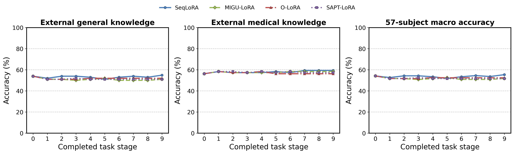

# 外部知识题：逐阶段表现与保留

使用已保存的基线及九个阶段 checkpoint，在不参与本次训练的固定 MMLU test 子集上补测。包含 51 个非医学学科各 2 题（102 题），6 个医学相关学科各 16 题（96 题），共 198 题。四方法、10 阶段均已完成，共核对 7,920 条选择题记录。

## 先看整体变化



所有阶段使用完全相同的题目和提示。通用、医学两组分别算匹配准确率；57 学科宏平均按学科等权，避免医学题多导致其权重过大。

| 方法 | 通用：基座 → 最终 | 医学：基座 → 最终 | 57 学科宏平均：基座 → 最终 |
|---|---:|---:|---:|
| SeqLoRA | 53.92% → 54.90% (+0.98 点) | 56.25% → 59.38% (+3.12 点) | 54.17% → 55.37% (+1.21 点) |
| MIGU-LoRA | 53.92% → 50.98% (-2.94 点) | 56.25% → 58.33% (+2.08 点) | 54.17% → 51.75% (-2.41 点) |
| O-LoRA | 53.92% → 51.96% (-1.96 点) | 56.25% → 56.25% (+0.00 点) | 54.17% → 52.41% (-1.75 点) |
| SAPT-LoRA | 53.92% → 50.98% (-2.94 点) | 56.25% → 57.29% (+1.04 点) | 54.17% → 51.64% (-2.52 点) |

## 原来答对的题，后来还答得对吗

| 方法 | 领域 | 基座答对 | 后来答错 | 原来答错、后来答对 | 保留基座正确答案的比例 |
|---|---|---:|---:|---:|---:|
| SeqLoRA | general | 55 | 6 | 7 | 89.09% |
| SeqLoRA | medical | 54 | 1 | 4 | 98.15% |
| MIGU-LoRA | general | 55 | 7 | 4 | 87.27% |
| MIGU-LoRA | medical | 54 | 1 | 3 | 98.15% |
| O-LoRA | general | 55 | 6 | 4 | 89.09% |
| O-LoRA | medical | 54 | 1 | 1 | 98.15% |
| SAPT-LoRA | general | 55 | 5 | 2 | 90.91% |
| SAPT-LoRA | medical | 54 | 1 | 2 | 98.15% |

同样的准确率可以由不同的“新答对 / 原来答对后又答错”组合产生，因此保留这两类问题的计数。全部相邻阶段的题目转变见 [transitions.csv](knowledge_probe_transitions.csv)。

## 全部阶段

| 方法 | 阶段 | 通用准确率 (%) | 医学准确率 (%) | 学科宏平均 (%) |
|---|---:|---:|---:|---:|
| SeqLoRA | 0 | 53.92 | 56.25 | 54.17 |
| SeqLoRA | 1 | 51.96 | 58.33 | 52.63 |
| SeqLoRA | 2 | 53.92 | 57.29 | 54.28 |
| SeqLoRA | 3 | 53.92 | 57.29 | 54.28 |
| SeqLoRA | 4 | 52.94 | 57.29 | 53.40 |
| SeqLoRA | 5 | 50.98 | 58.33 | 51.75 |
| SeqLoRA | 6 | 52.94 | 57.29 | 53.40 |
| SeqLoRA | 7 | 53.92 | 59.38 | 54.50 |
| SeqLoRA | 8 | 52.94 | 59.38 | 53.62 |
| SeqLoRA | 9 | 54.90 | 59.38 | 55.37 |
| MIGU-LoRA | 0 | 53.92 | 56.25 | 54.17 |
| MIGU-LoRA | 1 | 50.98 | 58.33 | 51.75 |
| MIGU-LoRA | 2 | 50.98 | 57.29 | 51.64 |
| MIGU-LoRA | 3 | 50.00 | 57.29 | 50.77 |
| MIGU-LoRA | 4 | 50.98 | 57.29 | 51.64 |
| MIGU-LoRA | 5 | 51.96 | 57.29 | 52.52 |
| MIGU-LoRA | 6 | 50.00 | 58.33 | 50.88 |
| MIGU-LoRA | 7 | 50.00 | 58.33 | 50.88 |
| MIGU-LoRA | 8 | 50.00 | 58.33 | 50.88 |
| MIGU-LoRA | 9 | 50.98 | 58.33 | 51.75 |
| O-LoRA | 0 | 53.92 | 56.25 | 54.17 |
| O-LoRA | 1 | 50.98 | 58.33 | 51.75 |
| O-LoRA | 2 | 50.98 | 57.29 | 51.64 |
| O-LoRA | 3 | 50.98 | 57.29 | 51.64 |
| O-LoRA | 4 | 51.96 | 58.33 | 52.63 |
| O-LoRA | 5 | 51.96 | 56.25 | 52.41 |
| O-LoRA | 6 | 51.96 | 56.25 | 52.41 |
| O-LoRA | 7 | 51.96 | 56.25 | 52.41 |
| O-LoRA | 8 | 51.96 | 56.25 | 52.41 |
| O-LoRA | 9 | 51.96 | 56.25 | 52.41 |
| SAPT-LoRA | 0 | 53.92 | 56.25 | 54.17 |
| SAPT-LoRA | 1 | 50.98 | 58.33 | 51.75 |
| SAPT-LoRA | 2 | 50.98 | 58.33 | 51.75 |
| SAPT-LoRA | 3 | 51.96 | 57.29 | 52.52 |
| SAPT-LoRA | 4 | 50.98 | 58.33 | 51.75 |
| SAPT-LoRA | 5 | 50.98 | 57.29 | 51.64 |
| SAPT-LoRA | 6 | 50.98 | 58.33 | 51.75 |
| SAPT-LoRA | 7 | 50.98 | 57.29 | 51.64 |
| SAPT-LoRA | 8 | 50.98 | 57.29 | 51.64 |
| SAPT-LoRA | 9 | 50.98 | 57.29 | 51.64 |

## 指标定义与适用范围

设固定题目集合为 $Q_g$：

$$
K_s^{(g)}=\frac{100}{|Q_g|}\sum_{q\in Q_g}\mathbf{1}\!\left[\widehat{y}_{s,q}=y_q\right].
$$

$$
\mathrm{Retention}_s^{(g)}=100\cdot\frac{\sum_{q\in Q_g}\mathbf{1}[\widehat{y}_{0,q}=y_q\;\land\;\widehat{y}_{s,q}=y_q]}{\sum_{q\in Q_g}\mathbf{1}[\widehat{y}_{0,q}=y_q]}.
$$

这是固定小样本的外部学科知识表现，并非完整 MMLU 分数，也不是“模型所有知识”的测量。非医学学科每科只有两题，单题影响明显；本轮只有一个训练种子，不提供多种子方差或声称显著性。医学相关组包括 anatomy、clinical_knowledge、college_biology、college_medicine、medical_genetics、professional_medicine。

采用统一的零样本四选一提示，只比较 A/B/C/D 下一 token 的 logits。概率只在这四个候选字母内归一化；这里的指标与九任务的生成答案 ROUGE-L 属于不同评测设置。题目不用于训练、选 checkpoint 或调参；无法确定模型原始预训练是否已见过 MMLU。

## 来源、保存与重算

来源：[MMLU 作者](https://github.com/hendrycks/test) / [cais/mmlu](https://huggingface.co/datasets/cais/mmlu)。下载通过镜像，固定 commit，核对 LFS SHA256；[协议与哈希](knowledge_probe_protocol.json)、[固定题目](knowledge_probe_items.jsonl)、[核对记录](knowledge_probe_verification.json) 均随报告保留。

各阶段逐题 prompt、token、候选概率、预测字母与参考保存在本次运行的 `knowledge_probe/<method>/`。补测脚本只读取原始训练 checkpoint，未改写训练结果；首次加载零阶段的空适配器状态已作为单独情形处理。

```bash
.plot-env/bin/python exp/prepare_knowledge_probe.py
# CUDA_VISIBLE_DEVICES 指定 GPU；断开终端后继续运行，并可复用已保存的批次
CUDA_VISIBLE_DEVICES=0 nohup setsid .plot-env/bin/python -u exp/evaluate_knowledge_probe.py --method seq_lora > /tmp/knowledge_probe.log 2>&1 < /dev/null &
.vision-env/bin/python summary_cv/collect_knowledge_probe.py
.plot-env/bin/python summary_cv/plot_process.py
```
