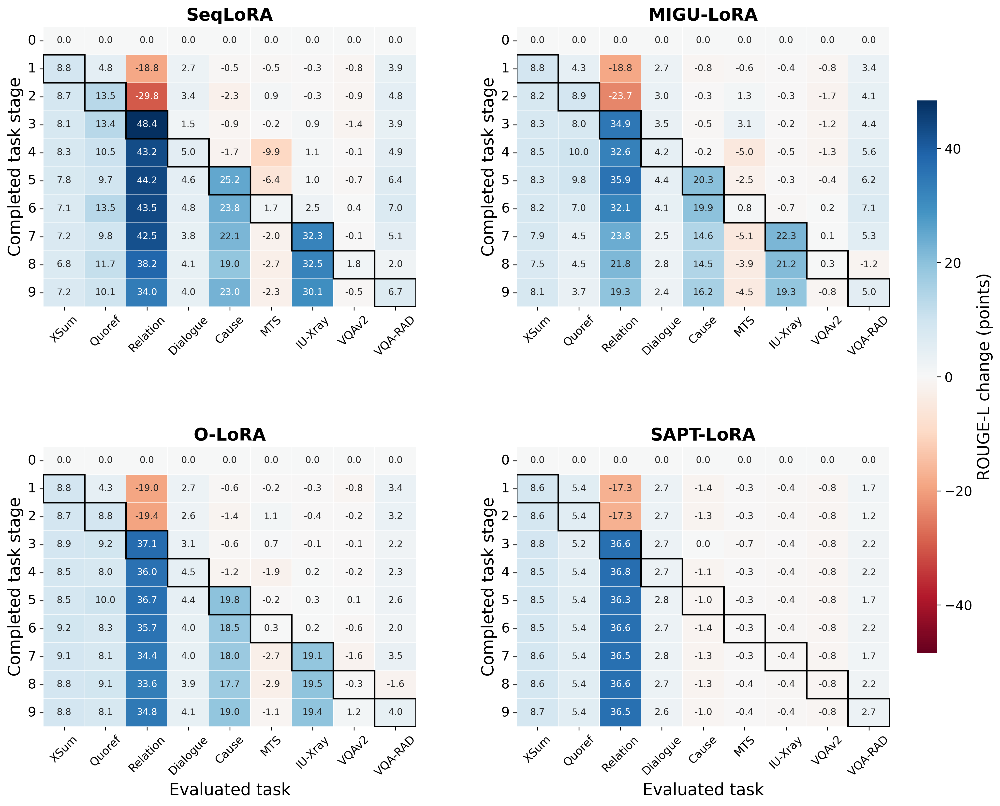
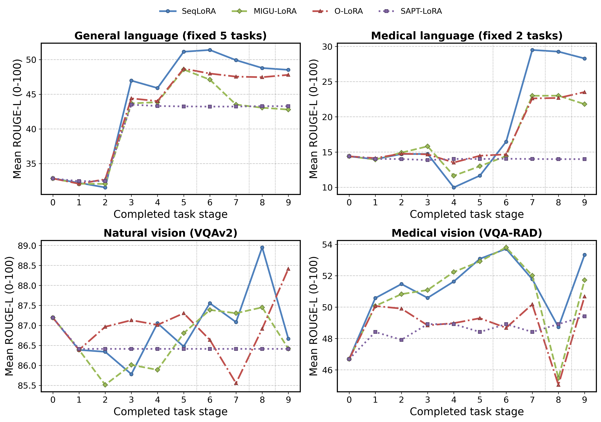
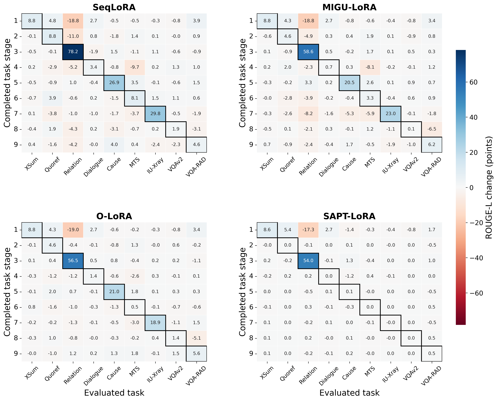
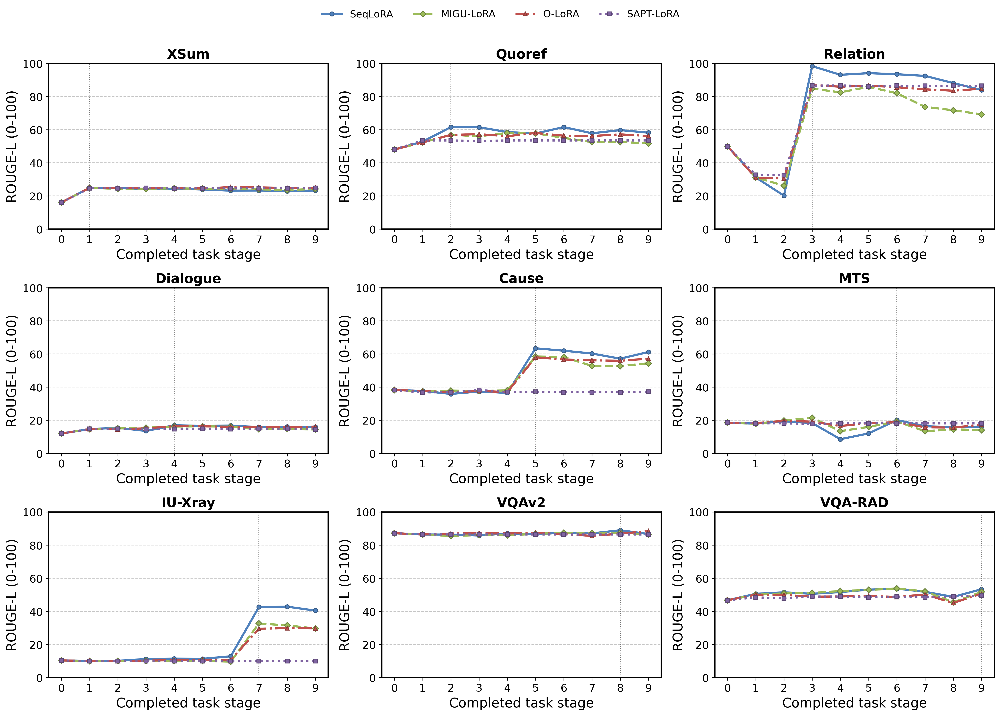

# Qwen2-VL 九任务学习全过程

以同一测试集贯穿基线与全部学习阶段，直接展示“什么时候学会、在哪里退化”。分数都是 ROUGE-L（0–100），差值单位为分数点。

## 先看全过程


<!-- figure-caption:start -->
**图 1｜Qwen2-VL 九任务：整体学习与保留过程。**

> **坐标与阶段：** 横轴是已完成学习的任务数。阶段 0 是未训练基座；1–5 依次学习摘要、阅读理解、关系抽取、对话、因果推理；6–7 学习医学对话记录和影像报告；8–9 学习自然与医学图像问答。
>
> **四个子图：** 左上在固定全部任务上算平均 ROUGE-L（0–100），看整体水平；右上只平均已学任务，看已学表现，但任务集合会增加。左下是本阶段更新前后，同一组旧任务的平均分差，负值说明旧任务受损；右下是尚未学习任务相对基座的平均分差，正值说明前序学习可能有帮助。下面两个子图的单位是分数点，0 线表示无变化；没有可比较任务时留空。
>
> **方法与读法：** 蓝色实线圆点＝SeqLoRA；绿色虚线菱形＝MIGU-LoRA；红色点划线三角＝O-LoRA；紫色点线方块＝SAPT-LoRA。先看左上是否整体提高，再看左下在哪一步出现下降。右上和右下的任务构成随阶段变化，曲线起伏也可能来自构成变化，需结合逐任务曲线。ROUGE-L 衡量参考文字重合，不是事实正确率。
<!-- figure-caption:end -->

左上固定全部任务，便于观察整体变化；右上只看已学任务，其任务构成会改变；左下在同一旧任务集合上比较本次更新前后；右下展示尚未学习任务相对基座的变化。没有旧任务/未来任务时留空，不填零。

## 按论文口径重算

| 方法 | 初始固定均分 | MFT 刚学完 ↑ | MFN / AP 最终 ↑ | MAA 全过程 ↑ | 遗忘幅度 ↓ | BWT ↑ | GEM FWT ↑ |
|---|---:|---:|---:|---:|---:|---:|---:|
| SeqLoRA | 36.320 | 52.234 | 48.799 | 46.303 | 3.890 | -3.864 | -3.397 |
| MIGU-LoRA | 36.320 | 48.040 | 43.964 | 42.460 | 4.871 | -4.586 | -2.559 |
| O-LoRA | 36.320 | 47.682 | 47.239 | 43.737 | 0.736 | -0.498 | -2.050 |
| SAPT-LoRA | 36.320 | 42.274 | 42.247 | 40.471 | 0.084 | -0.030 | -1.206 |

MFT、MFN、MAA 对应 MLLM-CL 的计算结构；本实验以生成任务 ROUGE-L 代替该论文的任务准确率，不能直接比较论文数值。EM 和 Token F1 的同口径重算也保存在 CSV。SAPT 原文 FWT 与 GEM 不同，需要独立单任务训练对照，这里记 N/A。

## 各任务相对基线的变化



<!-- figure-caption:start -->
**图 2｜Qwen2-VL 九任务：每个任务相对基座的变化。**

> **坐标与每个格子：** 四个子图分别对应四方法；横轴是被评测任务，纵轴是学习阶段。阶段 0 是未训练基座；1–5 依次学习摘要、阅读理解、关系抽取、对话、因果推理；6–7 学习医学对话记录和影像报告；8–9 学习自然与医学图像问答。格子中的数值＝该阶段任务得分−同一任务基座得分，单位为 ROUGE-L 分数点。
>
> **颜色与黑框：** 蓝色表示高于基座，红色表示低于基座，接近白色表示变化较小。色条给出数值范围，四方法共用同一范围；黑框标出该任务刚学完的格子。第 0 行全为 0，因为基座与自身比较。
>
> **任务缩写与读法：** XSum＝摘要，Quoref＝阅读理解，Relation＝关系抽取，Dialogue＝对话，Cause＝因果推理，MTS＝医学对话转记录，IU-Xray＝影像报告，VQAv2＝自然图像问答，VQA-RAD＝医学图像问答。沿同一列向下看一个任务如何变化；黑框以后颜色变浅或数值变小，说明刚学到的表现发生回落。该图比较基座，不能直接当作相邻阶段的学习收益。
<!-- figure-caption:end -->

每个格子是该阶段在一个固定任务上相对基座的分数变化；蓝色为提高，红色为下降。黑框是该任务刚学完的阶段。所有方法共享同一颜色范围。

## 四个领域如何变化



<!-- figure-caption:start -->
**图 3｜四个领域的表现如何随学习变化。**

> **坐标与子图：** 横轴是已完成任务数，纵轴是固定领域内任务的平均 ROUGE-L（0–100）。左上＝5 个通用语言任务，右上＝2 个医学语言任务，左下＝自然图像问答，右下＝医学图像问答；每个领域在所有阶段使用同一任务集合。
>
> **方法与分界线：** 蓝色实线圆点＝SeqLoRA；绿色虚线菱形＝MIGU-LoRA；红色点划线三角＝O-LoRA；紫色点线方块＝SAPT-LoRA。竖直灰色虚线位于阶段 5/6、7/8、8/9 之间，分别表示开始医学语言、自然图像和医学图像学习。阶段 0 是未训练基座；1–5 依次学习摘要、阅读理解、关系抽取、对话、因果推理；6–7 学习医学对话记录和影像报告；8–9 学习自然与医学图像问答。
>
> **怎样读：** 看某领域在开始训练后是否提高，以及后续训练其他领域时是否回落。例如蓝线在医学语言学习后提高、随后略降。各子图纵轴自动缩放、起点不同，不能用线条高度或视觉斜率跨子图比较变化大小；应比较坐标数值。
<!-- figure-caption:end -->

各领域使用固定任务集合。竖线标出开始医学语言、自然图像和医学图像之前的边界；任务顺序见下表。

## 哪一次任务切换影响了旧能力



<!-- figure-caption:start -->
**图 4｜每次任务切换带来了什么变化。**

> **坐标与每个格子：** 四个子图分别对应四方法；横轴是被评测任务，纵轴是本次学习阶段（1–9）。数值＝本阶段得分−上一阶段同一任务得分，单位为 ROUGE-L 分数点。XSum＝摘要，Quoref＝阅读理解，Relation＝关系抽取，Dialogue＝对话，Cause＝因果推理，MTS＝医学对话转记录，IU-Xray＝影像报告，VQAv2＝自然图像问答，VQA-RAD＝医学图像问答；T5 的 Reddit＝帖子摘要、SciQ＝科学问答。
>
> **颜色与黑框：** 蓝色＝本次更新后提高，红色＝本次更新后下降，接近白色＝变化较小；四方法共用同一色条范围。黑框是本阶段刚训练的任务，通常反映直接学习收益；它左侧是旧任务、右侧是未来任务。
>
> **怎样读：** 沿一行看一次训练同时怎样影响新、旧、未来任务。例如阶段 7 的 MIGU-LoRA 行可定位医学报告训练时旧能力的下降。这里比较相邻阶段，不是相对基座；很大的黑框收益也可能包含恢复之前丢失的能力。
<!-- figure-caption:end -->

这里每个格子是本阶段减去上一阶段，可同时看新任务收益、旧任务下降与未来任务变化。它定位变化发生的阶段，不单凭一张图证明某个训练机制的因果效果。



<!-- figure-caption:start -->
**图 5｜同一任务从基座到最终的完整轨迹。**

> **坐标与九个子图：** 每个小图是一个固定任务，横轴是已完成任务数（0–9），纵轴是该任务 ROUGE-L（0–100）；所有小图共用 0–100 纵轴范围。XSum＝摘要，Quoref＝阅读理解，Relation＝关系抽取，Dialogue＝对话，Cause＝因果推理，MTS＝医学对话转记录，IU-Xray＝影像报告，VQAv2＝自然图像问答，VQA-RAD＝医学图像问答；T5 的 Reddit＝帖子摘要、SciQ＝科学问答。
>
> **方法与学习时点：** 蓝色实线圆点＝SeqLoRA；绿色虚线菱形＝MIGU-LoRA；红色点划线三角＝O-LoRA；紫色点线方块＝SAPT-LoRA。每个小图中的竖直灰色虚线标出该任务刚学完的阶段；虚线前是尚未直接学习，虚线后是后续任务的影响。
>
> **怎样读：** 比较虚线前后相邻点，得到直接学习收益；比较阶段 0 与虚线处，判断是否超越基座；再看虚线处到阶段 9，判断保留还是回落。例如关系抽取的跃升很明显，医学对话记录没有同样的跃升，不能仅凭最终排名认为所有任务都学得好。
<!-- figure-caption:end -->

虚线对应该任务被学习的阶段；每个小图在同一固定任务上对比四方法。

## 同一问题的回答怎样变化

[回答演变表](answer_evolution.md) 覆盖 9 个任务、4 方法、10 阶段（360 条真实回答），完整文本和分数见 [JSON](answer_evolution.json)。

## 本轮具体观察

| 方法 | 最严重的一次旧任务平均下降 | 更新阶段 |
|---|---:|---|
| SeqLoRA | -2.658 | 4：Dialogue |
| MIGU-LoRA | -3.979 | 7：IU-Xray |
| O-LoRA | -0.905 | 4：Dialogue |
| SAPT-LoRA | -0.097 | 5：Cause |

例如，MIGU-LoRA 在学习 IU-Xray 的阶段 7，先前六个任务的平均分下降 3.979；SeqLoRA 在学习对话的阶段 4，先前三任务平均分下降 2.658。这类阶段性信息在最终 FWT 中看不到。

## 这些图是否等于全局知识变化

这些曲线覆盖本实验的任务表现，包括未到训练阶段的任务；它们不是模型全部知识的直接测量。独立外部知识题的逐阶段补测见 [知识保留报告](knowledge_probe.md)。只测这九个任务，无法判断未覆盖能力、OOD 泛化或内部知识是否擦除。

## 阶段与完整矩阵

| 阶段 | 本阶段学习的任务 |
|---:|---|
| 0 | 初始基座 |
| 1 | XSum |
| 2 | Quoref |
| 3 | Relation |
| 4 | Dialogue |
| 5 | Cause |
| 6 | MTS |
| 7 | IU-Xray |
| 8 | VQAv2 |
| 9 | VQA-RAD |

### SeqLoRA

| 阶段 | XSum | Quoref | Relation | Dialogue | Cause | MTS | IU-Xray | VQAv2 | VQA-RAD |
|---:|---:|---:|---:|---:|---:|---:|---:|---:|---:|
| 0 | 16.074 | 48.046 | 49.954 | 11.954 | 38.192 | 18.427 | 10.358 | 87.193 | 46.684 |
| 1 | 24.845 | 52.796 | 31.150 | 14.610 | 37.685 | 17.932 | 10.032 | 86.389 | 50.575 |
| 2 | 24.729 | 61.571 | 20.183 | 15.402 | 35.859 | 19.351 | 10.093 | 86.341 | 51.473 |
| 3 | 24.205 | 61.471 | 98.375 | 13.499 | 37.318 | 18.258 | 11.211 | 85.782 | 50.589 |
| 4 | 24.374 | 58.559 | 93.144 | 16.916 | 36.490 | 8.527 | 11.431 | 87.056 | 51.633 |
| 5 | 23.892 | 57.707 | 94.136 | 16.556 | 63.418 | 12.009 | 11.323 | 86.472 | 53.083 |
| 6 | 23.190 | 61.576 | 93.494 | 16.753 | 61.962 | 20.086 | 12.843 | 87.556 | 53.716 |
| 7 | 23.277 | 57.826 | 92.483 | 15.787 | 60.260 | 16.379 | 42.609 | 87.083 | 51.780 |
| 8 | 22.887 | 59.758 | 88.168 | 16.008 | 57.143 | 15.705 | 42.814 | 88.952 | 48.728 |
| 9 | 23.263 | 58.182 | 83.977 | 16.004 | 61.193 | 16.133 | 40.438 | 86.667 | 53.336 |

### MIGU-LoRA

| 阶段 | XSum | Quoref | Relation | Dialogue | Cause | MTS | IU-Xray | VQAv2 | VQA-RAD |
|---:|---:|---:|---:|---:|---:|---:|---:|---:|---:|
| 0 | 16.074 | 48.046 | 49.954 | 11.954 | 38.192 | 18.427 | 10.358 | 87.193 | 46.684 |
| 1 | 24.889 | 52.296 | 31.150 | 14.669 | 37.432 | 17.872 | 10.004 | 86.389 | 50.075 |
| 2 | 24.285 | 56.932 | 26.207 | 14.986 | 37.873 | 19.743 | 10.088 | 85.514 | 50.828 |
| 3 | 24.364 | 56.046 | 84.819 | 15.492 | 37.711 | 21.491 | 10.147 | 86.014 | 51.089 |
| 4 | 24.600 | 58.001 | 82.543 | 16.167 | 37.966 | 13.379 | 9.900 | 85.889 | 52.240 |
| 5 | 24.337 | 57.831 | 85.875 | 16.323 | 58.502 | 15.958 | 10.038 | 86.806 | 52.917 |
| 6 | 24.309 | 55.067 | 82.010 | 16.077 | 58.077 | 19.225 | 9.634 | 87.389 | 53.808 |
| 7 | 24.019 | 52.500 | 73.788 | 14.462 | 52.786 | 13.333 | 32.653 | 87.306 | 52.008 |
| 8 | 23.537 | 52.583 | 71.713 | 14.755 | 52.702 | 14.498 | 31.516 | 87.452 | 45.476 |
| 9 | 24.211 | 51.717 | 69.268 | 14.380 | 54.365 | 13.974 | 29.625 | 86.417 | 51.719 |

### O-LoRA

| 阶段 | XSum | Quoref | Relation | Dialogue | Cause | MTS | IU-Xray | VQAv2 | VQA-RAD |
|---:|---:|---:|---:|---:|---:|---:|---:|---:|---:|
| 0 | 16.074 | 48.046 | 49.954 | 11.954 | 38.192 | 18.427 | 10.358 | 87.193 | 46.684 |
| 1 | 24.919 | 52.296 | 30.950 | 14.625 | 37.640 | 18.244 | 10.034 | 86.389 | 50.075 |
| 2 | 24.799 | 56.862 | 30.598 | 14.568 | 36.794 | 19.571 | 9.988 | 86.966 | 49.905 |
| 3 | 24.942 | 57.293 | 87.089 | 15.063 | 37.638 | 19.126 | 10.229 | 87.132 | 48.838 |
| 4 | 24.617 | 56.062 | 85.929 | 16.435 | 37.010 | 16.484 | 10.554 | 87.014 | 48.979 |
| 5 | 24.537 | 58.018 | 86.637 | 16.306 | 57.974 | 18.259 | 10.700 | 87.306 | 49.293 |
| 6 | 25.300 | 56.368 | 85.642 | 15.997 | 56.658 | 18.765 | 10.583 | 86.639 | 48.680 |
| 7 | 25.139 | 56.177 | 84.361 | 15.905 | 56.156 | 15.739 | 29.498 | 85.556 | 50.180 |
| 8 | 24.850 | 57.177 | 83.532 | 15.886 | 55.875 | 15.503 | 29.861 | 86.917 | 45.044 |
| 9 | 24.844 | 56.185 | 84.737 | 16.081 | 57.165 | 17.329 | 29.715 | 88.417 | 50.679 |

### SAPT-LoRA

| 阶段 | XSum | Quoref | Relation | Dialogue | Cause | MTS | IU-Xray | VQAv2 | VQA-RAD |
|---:|---:|---:|---:|---:|---:|---:|---:|---:|---:|
| 0 | 16.074 | 48.046 | 49.954 | 11.954 | 38.192 | 18.427 | 10.358 | 87.193 | 46.684 |
| 1 | 24.653 | 53.493 | 32.669 | 14.700 | 36.767 | 18.088 | 9.962 | 86.414 | 48.416 |
| 2 | 24.629 | 53.493 | 32.619 | 14.700 | 36.862 | 18.093 | 9.935 | 86.414 | 47.916 |
| 3 | 24.832 | 53.243 | 86.583 | 14.617 | 38.209 | 17.740 | 9.984 | 86.414 | 48.916 |
| 4 | 24.584 | 53.493 | 86.750 | 14.657 | 37.046 | 18.147 | 9.915 | 86.414 | 48.916 |
| 5 | 24.608 | 53.493 | 86.250 | 14.743 | 37.144 | 18.105 | 9.932 | 86.414 | 48.416 |
| 6 | 24.551 | 53.493 | 86.583 | 14.639 | 36.831 | 18.149 | 9.954 | 86.414 | 48.916 |
| 7 | 24.637 | 53.493 | 86.417 | 14.739 | 36.862 | 18.088 | 9.954 | 86.414 | 48.416 |
| 8 | 24.707 | 53.493 | 86.583 | 14.697 | 36.934 | 18.076 | 9.914 | 86.414 | 48.916 |
| 9 | 24.759 | 53.493 | 86.417 | 14.560 | 37.163 | 18.076 | 9.929 | 86.414 | 49.416 |

## 指标定义与公式

设 $R_{s,j}$ 是学完第 $s$ 个任务后的任务 $j$ 得分，$R_{0,j}$ 为基座。任务 $j$ 的刚学完分数位于 $R_{j,j}$。

$$
\begin{aligned}
\mathrm{MFT} &= \frac{1}{T}\sum_{j=1}^{T} R_{j,j},\\
\mathrm{MFN} &= \frac{1}{T}\sum_{j=1}^{T} R_{T,j},\\
\mathrm{MAA} &= \frac{1}{T}\sum_{s=1}^{T}\left(\frac{1}{s}\sum_{j=1}^{s}R_{s,j}\right).
\end{aligned}
$$

MFT 是刚学完各任务的平均分，不保证是真正的上界；后续学习也可能让旧任务更好。MFN 与此处 AP 相同，MAA 汇总整个学习过程。

$$
\begin{aligned}
A_s^{\mathrm{fixed}} &= \frac{1}{T}\sum_{j=1}^{T}R_{s,j},\\
S_s^{\mathrm{old}} &= \frac{1}{s-1}\sum_{j=1}^{s-1}(R_{s,j}-R_{s-1,j}),\quad s\ge 2,\\
G_s^{\mathrm{new}} &= R_{s,s}-R_{s-1,s},\\
U_s &= \frac{1}{T-s}\sum_{j=s+1}^{T}(R_{s,j}-R_{0,j}),\quad s<T.
\end{aligned}
$$

这里的旧任务切换冲击固定了比较的任务集合，避免新任务加入均值造成构成变化；MedCL-Bench 的原文另报告相邻已学任务平均分的差，原口径的差值也保留在过程 CSV 的 `seen_mean_transition` 列。`stage_forgetting` 记录每阶段旧任务历史最好分至当阶段的平均下降。未来任务集合仍随阶段变化，应配合逐任务曲线阅读。

## 来源、实现与重算

[论文指标对照](../paper/evaluation_and_process.md) 逐项说明可复原和缺少对照的项目。一个种子无法重建多种子标准差；没有 oracle、外部 OOD 测试和中间激活时，相关项目标 N/A，不能从最终数字反推。

精确数据及指标在本目录的过程 JSON / CSV，绘图不做平滑或填补。300 DPI PNG 位于 `sample/`，矢量 PDF 位于 `summary_cv/figures/`。

```bash
.vision-env/bin/python summary_cv/process.py
.vision-env/bin/python summary_cv/reconstruct_metrics.py
.plot-env/bin/python summary_cv/plot_process.py
```
